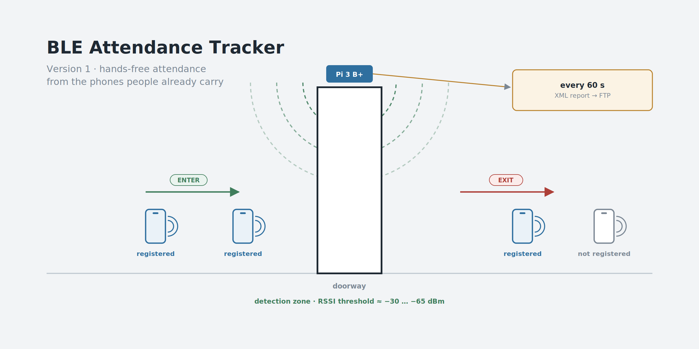
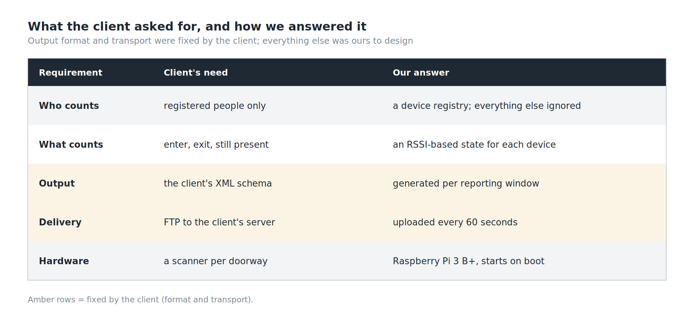
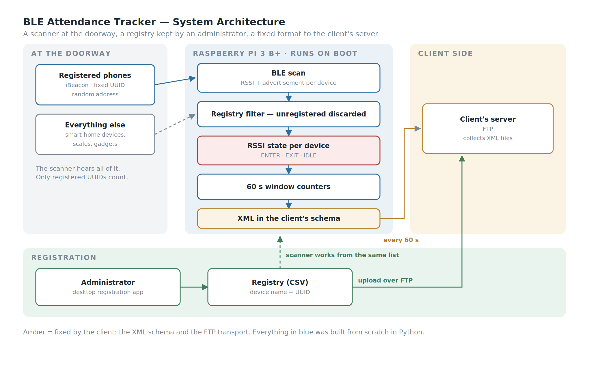
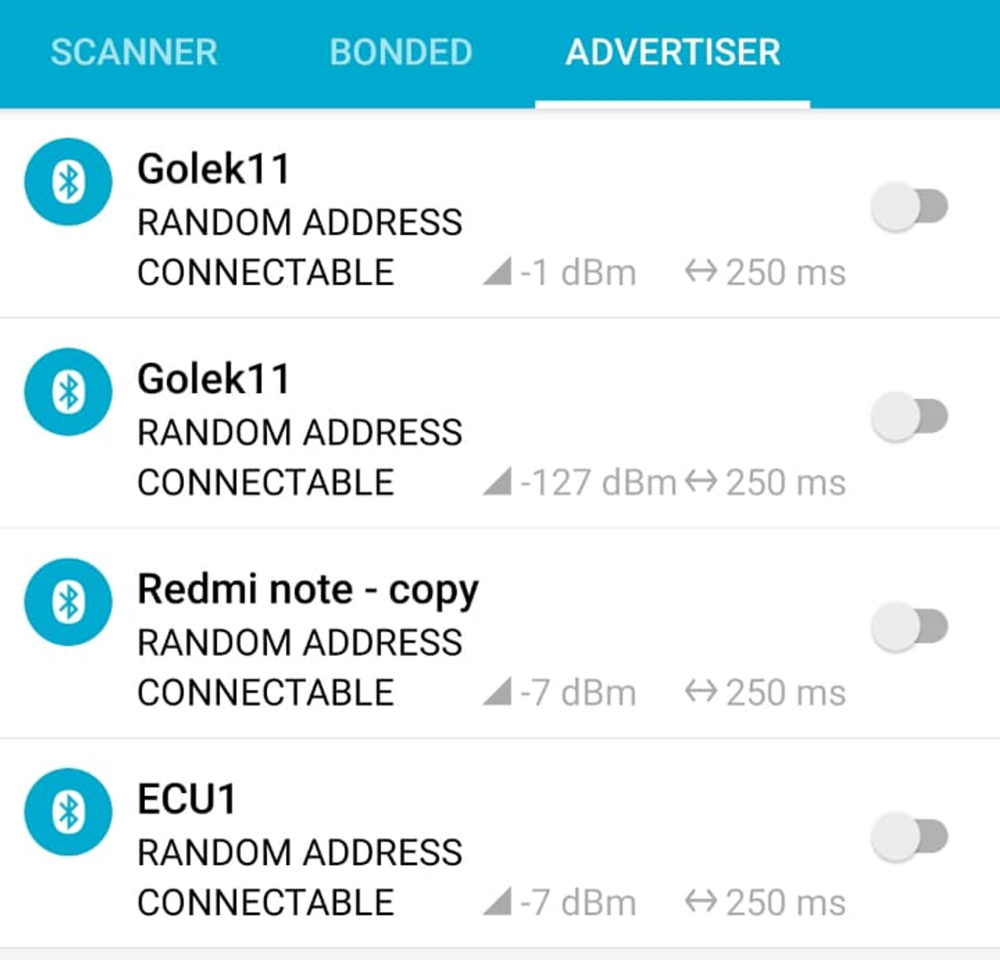
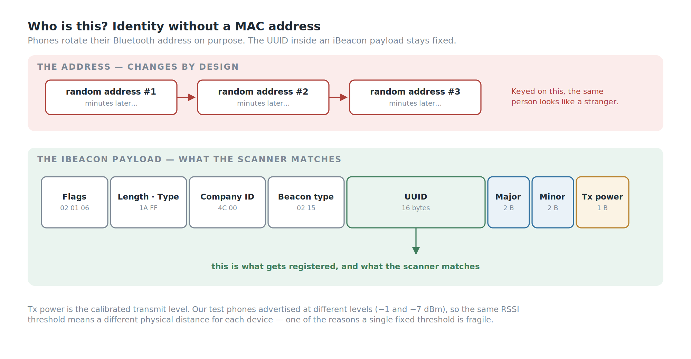
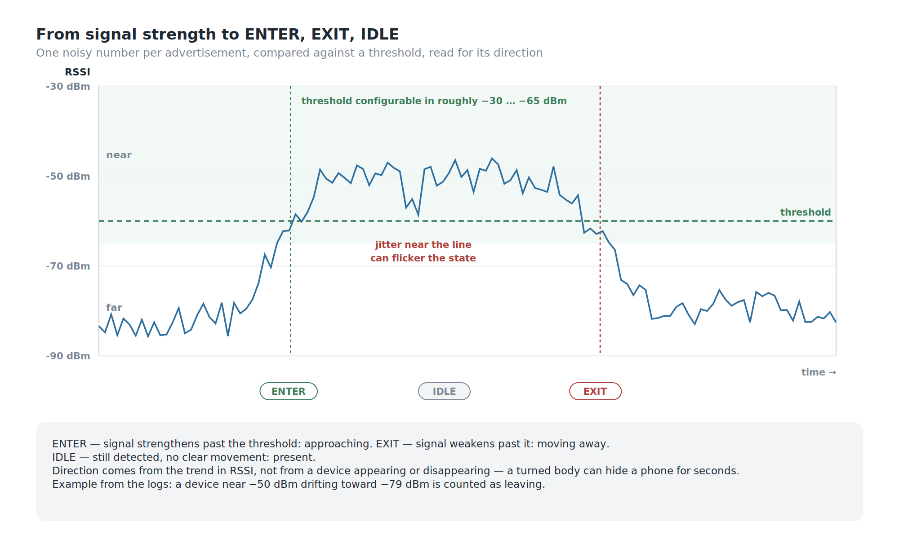
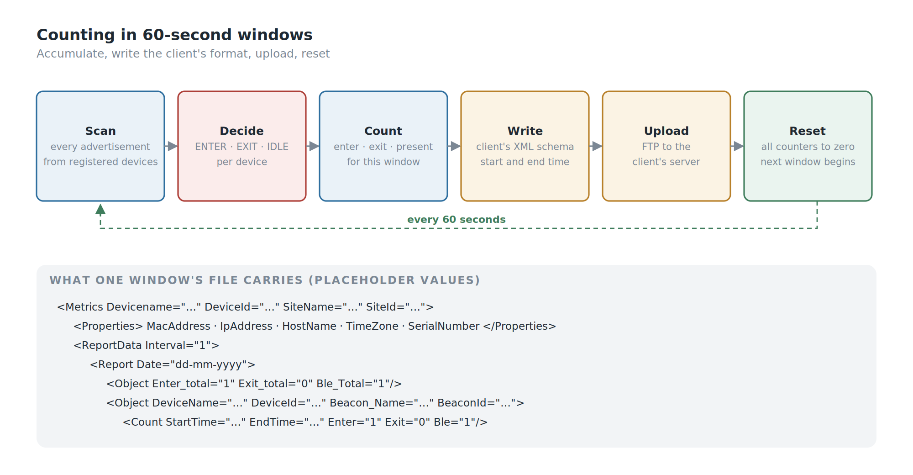
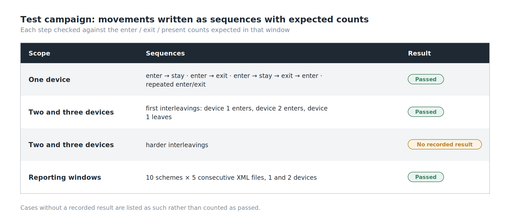

*BLE Attendance Tracker: Version 1. A scanner at the doorway, listening for registered phones.*

## Background

Attendance sounds like a solved problem. People tap a card, or press a finger on a reader, and a log records it.

Both of those need the person to do something. The request we were given was for attendance that happens without anyone stopping: people walk into a room, and the system knows they arrived; they walk out, and it knows they left. No queue at the door and nothing to tap. The one thing each person has to do is set their phone up once to broadcast.

The thing almost everyone already carries through a door is a phone, and a phone can broadcast a small Bluetooth Low Energy signal. So the idea is simple to state: put a scanner at the doorway, listen for registered devices, and turn what it hears into *entered* and *exited*.

Stating it took one sentence. Making it work took most of the project, because the only thing the scanner can measure is signal strength — and signal strength is a noisy, indirect, deeply unreliable stand-in for distance.

## My Role

- **Ega Guntara** — Project Lead, IoT Engineer
- **Dede Sopian** — Engineer

Built under **Aligness** as a paid, three-month client engagement, and handed over to the client as a working prototype. The client is confidential, and so is the installation site, which is why the images in this article are diagrams rather than photos.

## Case Study

Three constraints shaped the whole design, and only one of them was technical.

**The output format was fixed.** The client's server already expected attendance data in a particular XML structure — a `Metrics` document with device properties, then `ReportData`, then per-device `Count` entries carrying `Enter`, `Exit` and a count of devices present. We didn't design that schema; we had to produce it exactly.

**The transport was fixed too.** Those XML files had to arrive at the client's server over **FTP**. Not MQTT, not an HTTP API — FTP, because that is what the receiving side was built to collect. A more modern design would have streamed events; this one had to write files and drop them on a server on a schedule, and the architecture follows from that.

**The client had already tried.** Alongside the brief came their own draft: a Node.js gateway built on existing BLE and beacon-scanning libraries. We read it as a reference and built our system from scratch in Python instead, on a Raspberry Pi 3 B+ — scanning, RSSI processing, the threshold, the enter/exit logic, device state, the counting, and the data preparation all written in-house.

*Two of the five requirements were fixed before we started: the format and the transport.*

## Workflow

*A scanner at the doorway, a registry kept by an administrator, and a fixed format on a fixed schedule to the client's server.*

The flow has three sides.

**The registration side.** An administrator registers each person's device — a name and the device's beacon UUID — through a small desktop app. The registry is a CSV file, pushed to the server over FTP so the scanner works from the same list.

**The scanner side.** The Raspberry Pi starts the tracker on boot. It scans continuously, ignores every device that isn't registered, reads the signal strength of the ones that are, and decides for each whether it is entering, leaving, or simply present.

**The reporting side.** Every 60 seconds, the counts for that window are written into the client's XML format and uploaded over FTP. Then the counters reset and the next window begins.

## Building the System

### Who Is This? — Identity Without a MAC Address

The obvious way to recognise a Bluetooth device is its address. It is the wrong way.

Modern phones advertise with a **random address** that changes periodically, precisely so that they *can't* be tracked by address. Our own test phones showed exactly that: every advertiser listed as "random address". A tracker keyed on addresses would see the same person as a new stranger every few minutes.

*Our test phones as advertisers: every one listed as a random address, and at different transmit powers.*

So identity comes from inside the advertisement instead. A phone set up to broadcast as an **iBeacon** puts a fixed 16-byte **UUID** in its payload, along with two smaller identifiers, major and minor, and a calibrated transmit power. That UUID is what gets registered, and that UUID is what the scanner matches.

*The address changes. The UUID inside the payload doesn't.*

### The Room Is Full of Bluetooth

The first time the scanner came up in a real room, the log filled immediately — with things that were not people. Smart-home devices, a bathroom scale, unnamed gadgets, all advertising, at signal strengths anywhere from strong to barely there.

None of them were registered, so each was logged as *device not registered* and discarded. That filter is the first thing the tracker does with every packet, and it's the reason the counts mean anything at all: in a real building, the people you care about are a small minority of the Bluetooth devices in range.

### Direction From Signal Strength

This is the core of the project.

The scanner can't see where a device is. It sees one number per advertisement: the **RSSI**, the received signal strength, in dBm. Closer is stronger — a value near −50 dBm means near, a value near −80 dBm means far. Everything else has to be inferred from how that number behaves.

So each registered device is placed in one of three states by comparing its RSSI against a **threshold**, configured in the range of roughly **−30 to −65 dBm**, and by watching the direction it moves:

- **ENTER** — the signal strengthens past the threshold: the device is approaching the detection zone. The window records `enter = 1`.
- **EXIT** — the signal weakens past the threshold: the device is moving away. The window records `exit = 1`.
- **IDLE** — the device is still detected, but nothing indicates entering or leaving: it's simply there. The window records it as present.

In the logs this reads cleanly when it works: a device sitting near −50 dBm that drifts toward −79 dBm moves from the near side to the far side, and is counted as leaving. When the signal strengthens again, it's counted as arriving.

The important design choice here is what *isn't* used. Appearing and disappearing — "we heard it" and "we stopped hearing it" — would be the obvious signal. It is also a poor one: a device can drop out for a few seconds because someone turned their body, and reappear without having gone anywhere. Direction comes from the **trend in signal strength**, not from presence.

*A threshold turns one noisy number into three states. The hard part is the noise.*

### Counting in Windows

Each device's state feeds a set of counters, and the counters work in **60-second windows**.

Within a window, the tracker accumulates how many registered devices entered, how many left, and how many are present. At the end of the window, those numbers are written into the client's XML — per device, with the window's start and end times — and uploaded over FTP. Then every counter goes back to zero and the next window starts.

The per-device logic also has to handle sequences that don't look like the textbook case: a device that exits without ever having been seen to enter, the same event reported twice, an entry immediately after an exit. Each of those combinations has an explicit rule rather than being left to fall out of the arithmetic — which is exactly what the test campaign below was designed to exercise.

*Accumulate for sixty seconds, write the client's format, upload, reset.*

### Registration

Registration is a small desktop app: enter a device name and its 32-character UUID, and the app formats it, checks it isn't already registered, adds it to the registry, and uploads the registry to the server. Register and de-register buttons stay disabled until the UUID is exactly the right length, which removes the most common data-entry mistake before it happens.

### Starting on Its Own

The tracker is launched from **crontab** at boot. A scanner mounted above a doorway is not something anyone should have to log into after a power cut; if the Pi has power, the tracker is running. What crontab doesn't do is restart the tracker if it crashes; a production build would run it as a systemd service with automatic restart.

## Testing

The test design is the part of this project I'd point a QA reviewer at.

Instead of judging it by eye, we wrote the movements down as **sequences with expected outputs**, and checked the counts after each step:

- **One device**, through the patterns that matter: enter then stay; enter then exit; enter, stay, exit, enter again; enter and exit repeatedly.
- **Two and three devices together**, with their movements interleaved — device one enters, device two enters, device one leaves — because a tracker that counts one person perfectly can still fail the moment two people cross paths.
- **Ten reporting schemes across five consecutive XML windows**, each with the exact enter/exit/present counts expected in every file, for one device and then for two moving independently.

Every single-device sequence, the first two- and three-device interleavings, and all the reporting schemes passed. Several of the harder multi-device interleavings have no recorded result — they're in the plan, not in the evidence, and I'd rather say so than leave them looking finished.

*What was tested, and what wasn't. Cases without a recorded result stay marked that way.*

## What Went Wrong

**RSSI jumps around.** That is the whole problem in three words.

A person standing perfectly still can produce readings that swing by several dBm from one advertisement to the next. Bodies absorb 2.4 GHz signals, so the same phone reads differently depending on which way its owner is facing. Walls and people reflect it. And a threshold applied to a jumping signal does exactly what you'd expect: when the reading hovers near the line, the state flickers between sides, and a person who never moved gets counted as leaving and arriving.

Transmit power makes it harder still. Our own test phones were advertising at different power settings — one at −1 dBm, others at −7 dBm. A fixed RSSI threshold therefore corresponds to a *different physical distance* for each device: the same line in dBm is a metre away for one phone and noticeably further for another.

Neither of these is a bug in the code. They are properties of the signal, and a prototype that works in a controlled test is not yet a system that is right in a busy doorway. The honest summary is that the logic is sound and the input is the weak link — and the next version has to spend its effort there.

## SWOT Analysis

**Strengths.** Identity comes from the iBeacon UUID rather than the device address, so randomised addresses don't break recognition. Unregistered devices are discarded first, which keeps a crowded radio environment from polluting the counts. Direction is inferred from the trend in signal strength rather than from presence, which is more robust to momentary dropouts. The output matches the client's required format and transport exactly. And the enter/exit logic was tested against written sequences with expected counts, for multiple devices and across consecutive reporting windows.

**Weaknesses.** Raw RSSI is noisy enough that a single threshold can flicker when a device sits near it. One threshold is shared by devices that transmit at different power levels. Some of the multi-device test cases have no recorded result. And the registration app's duplicate check compares an unformatted UUID with the formatted value stored in the registry, so the same UUID can slip in under a second name.

**Opportunities.** Smoothing the RSSI before deciding — a moving average over several advertisements — and using two thresholds instead of one, so a device has to move clearly past the line before its state changes, would address most of the flicker. The iBeacon payload already carries a calibrated transmit power, which could be used to normalise the threshold per device. And two scanners on either side of a doorway would turn direction from an inference into a comparison.

**Threats.** The system depends on people's phones advertising reliably, and phone operating systems increasingly restrict background Bluetooth behaviour. On iPhones, an app can only broadcast as an iBeacon while it is open in the foreground, so iPhone users would need a different approach, such as a small dedicated beacon tag. The fixed format and FTP transport mean the system inherits whatever limits the receiving server has. And attendance data is personal data — any production version needs a clear answer on consent and retention before it counts a single person.

## Conclusion

Against what we set out to do:

1. **Recognised registered devices reliably**, by keying on the iBeacon UUID rather than an address that changes by design.
2. **Filtered a crowded radio environment** down to the devices that matter.
3. **Derived entering and leaving from signal strength**, using its trend against a threshold rather than mere presence.
4. **Delivered the client's format on the client's schedule** — XML windows over FTP, every sixty seconds, starting on boot.
5. **Did not tame the signal.** RSSI jitter and differing transmit powers are the reason this is a prototype rather than a product.

The lesson is about where the difficulty actually lives.

Most of what we built — the registry, the state logic, the counters, the XML, the upload — is ordinary engineering, and it worked. The part that decided whether the system was *right* was the one number we couldn't control: a signal-strength reading that moves when nobody does.

When a system's only view of the world is a noisy measurement, the measurement is the project. Everything downstream can only be as correct as that number allows.

The next version of the tracker starts with the signal.

---
