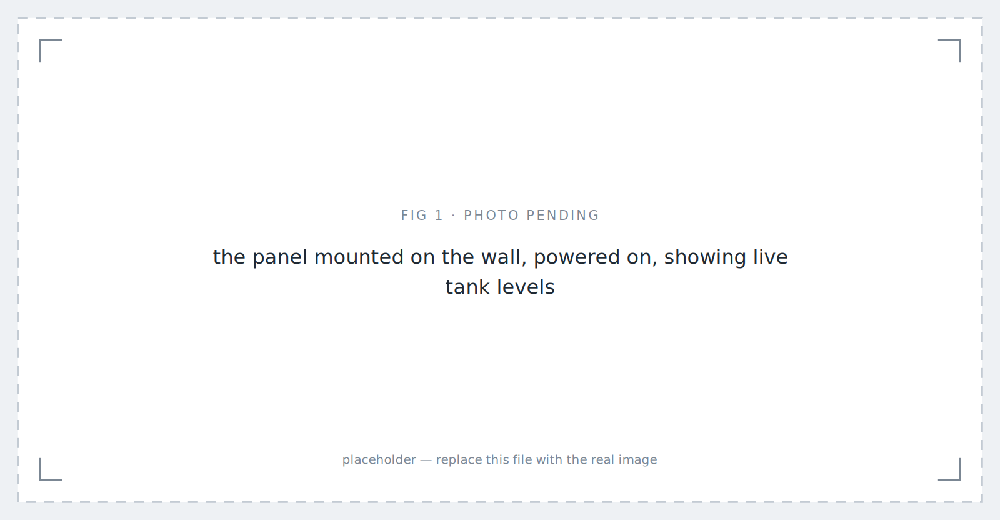
*Flood & Water Tank Monitoring: Version 1 — the wall panel — placeholder image.*

## Background

Two things go wrong at my house.

When it rains hard, the porch floods. Every time. Someone has to drag out a water pump, set it up, and drain the porch by hand.

The second one is quieter but happens more often. We have two water tanks. Filling them means standing at the faucets and switching the flow from one tank to the other the moment the first one is full — and the only way to know it's full is to go and look. The outlet faucets need the same attention for daily use.

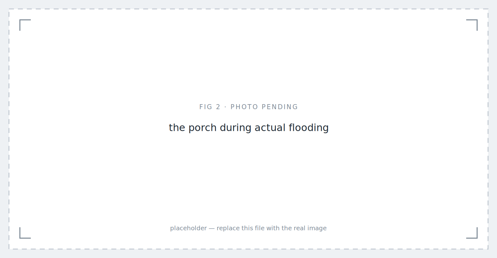
*The problem, roughly annually. — placeholder image.*

Neither problem is hard. Both need someone to be physically present, paying attention, at the right moment.

The people at my house are my parents. They are old enough that "go outside during a rainstorm and set up a pump" and "climb up and check a tank, then switch a faucet" are not small requests.

That last sentence is the entire design brief. Not *build a smart home system*. Build something my parents will actually use. And that immediately ruled out the obvious answer.

The obvious answer is a phone app. It's cheaper, faster to build, and most IoT projects stop there. But an app assumes a user who will install it, keep it updated, remember which icon it is, and open it before they need it. My parents will not do that, and I don't blame them. What they will use is a thing on the wall that is always showing the answer, with buttons you press.

So the interface came first, and everything else was built to feed it.

*The only acceptance test that mattered. — placeholder image.*

## My Role

- **Ega Guntara** — Project Lead, System Design, Firmware, LVGL Interface, Integration
- **Dede Sopian** — PCB Schematic & Layout, Assembly, Firmware Support

A personal project, built with Aligness members, from early 2026 to July 2026.

I designed the system and wrote the firmware and the interface. Dede did the board work — schematic, layout, and soldering — and supported on firmware. Below, **"I" means work I owned personally and "we" means both of us.**

## Case Study

The site is my own house, which makes this project unusual in one useful way: I am not guessing at the requirements, and I cannot escape the consequences of getting them wrong.

**The tanks.** Two 500-litre tanks, both outdoors, on the upper floor. Roughly 20 metres from where the panel would go. Filling is a two-tank juggling act — one fills, someone notices, someone switches the faucet, the other fills.

**The porch.** Heavy rain floods it, and someone has to drag out a pump and drain it by hand.

The first thing we built was not electronic. We dug a pit in the porch to house the water pump and the flood sensor together. When the porch floods, the pit fills first, and the water gets pumped out from there.

That pit is the most important piece of engineering in the project, and none of it is code.

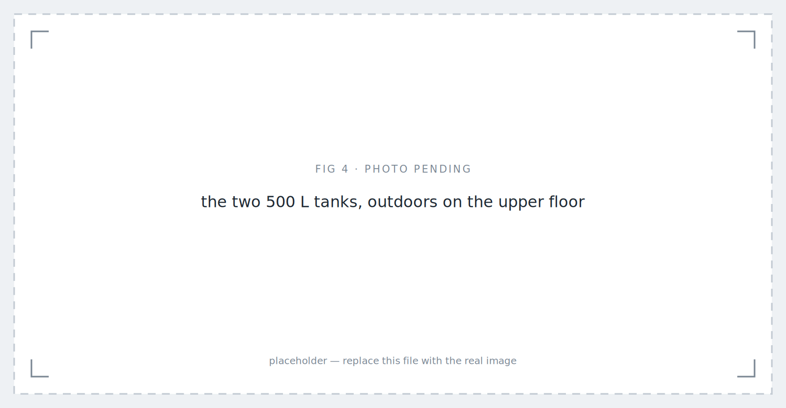
*The two 500 L tanks, outdoors on the upper floor — placeholder image.*

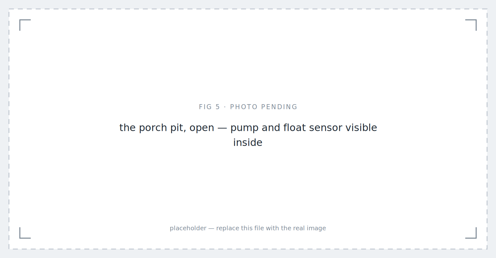
*The pit, dry. During heavy rain it fills before the porch surface does. — placeholder image.*

**The operators.** Two people who are not going to learn a new app, at any point, for any reason.

*Requirements table as an image — Medium will not render it as text — placeholder image.*

So the questions were:

| Requirement | Before | This system |
|---|---|---|
| Know how full each tank is | climb up and look | ✅ continuous, as a percentage of each tank |
| Switch filling between two tanks | manual faucet | ✅ inlet solenoid valves from the panel |
| Choose which tank feeds the house | manual faucet | ✅ outlet solenoid valves from the panel |
| Know the porch is flooding | look outside | ✅ float sensor in the pit |
| Drain the porch | set up the pump by hand | ✅ automatic on detection |
| Operate any of it | be physically present | ✅ one panel, one place |
| Use it without a smartphone | — | ✅ the whole point |

## Designing for the operator first

The panel is a **Waveshare ESP32-P4-WIFI6-Touch-LCD-4B** — a dual-core RISC-V ESP32-P4 with a 720×720 touch display, in an 86-box form factor that mounts on the wall like a light switch. The interface is built with **LVGL**, designed in SquareLine Studio. There are four screens: a **main screen**, a **water tower monitor**, a **flood monitor**, and a **WiFi connection screen**. Tank level is shown as a **percentage** — my parents do not need to know that a tank holds 340 litres, they need to know it's two-thirds full.

Every screen runs in **English or Bahasa Indonesia**, switchable. Realistically the household will only ever use one of those, and it isn't English. The one that matters is the one my parents read, and building it in their language was not a localisation feature. It was the requirement.

*Two tanks, one flood status, and buttons big enough to hit without aiming. — placeholder image.*

Two reasons for that choice, and I'll be honest that they're both real.

The first is the users. A wall panel is *always on and always showing state*. There is no app to open, no login, no notification to miss. If my mother wants to know whether the tank is full, she looks at the wall on her way past. That is a fundamentally different interaction model from a phone, and for these users it's the only one that works. The 86-box form factor matters too — it looks like a light switch, not like a piece of equipment.

The second is that I wanted to learn LVGL and the ESP32-P4 properly, and a real system in a real house with real users is a much harder teacher than a demo on a desk. That reason is not as noble as the first one, but it's true, and it shaped the project.

## The board we already had

Before the sensors, a word about what they plug into — and about a decision that was made before this project existed.

The tanks and the porch pit need completely different sensing. An ultrasonic ranging module speaks UART and needs four wires. A float switch is a contact closure and needs two. Two sensors, two interfaces, and the obvious approach is two board designs.

We didn't design either one for this project. Dede had already drawn a **general-purpose sensor node board** — Node Sensor V2 — before this system was on the table, and it handles both cases on one PCB. A 50 × 50 mm two-layer board built around an ESP-WROOM-32, carrying a **2-pin JST-XH header for a contact-closure sensor and a separate 4-pin JST-XH header for a UART sensor**, with slide switches on the board and matching handling in firmware to select which mode it's running in.

So this project did not begin at a blank schematic. It began with a board on the shelf that already did what it needed, and the work became integration rather than design. That is worth saying out loud, because reusing your own hardware is unglamorous and enormously effective — the difference between a project that ships in months and one that spends its first six weeks in PCB revisions before a single litre of water gets measured.

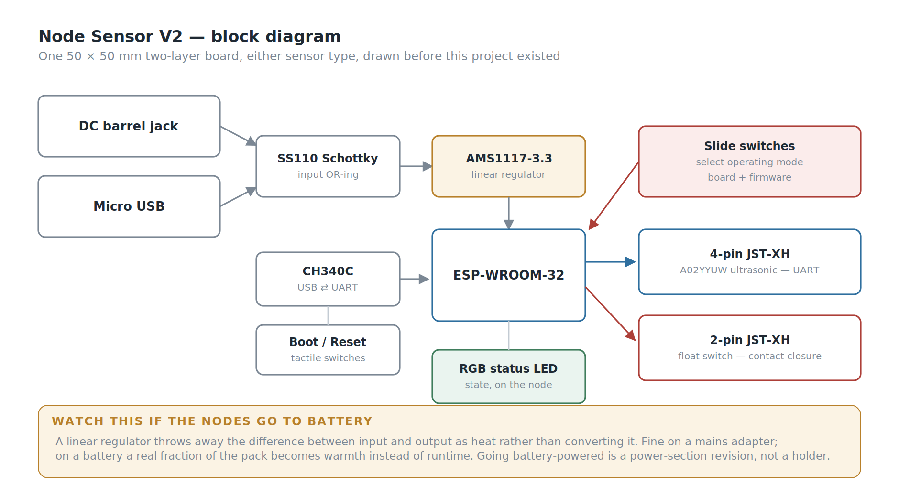
*One board, two sensor types. The 2-pin header takes a float switch; the 4-pin takes the ultrasonic module's UART.*

*Photo of the node PCB — bare and populated — placeholder image.*

The rest of the board is the unglamorous work that makes a device field-serviceable rather than merely functional. A **CH340C** with boot and reset buttons means the node can be reflashed over plain micro USB by anyone with a cable, no external programmer and no dangling header. Power comes in through **either** a DC barrel jack **or** micro USB, with a Schottky diode preventing the two from fighting each other. An **RGB status LED** reports the node's state on the node itself — which matters when the device is on a roof twenty metres from the panel and you need to know whether it has WiFi without walking back inside to check.

One board type, one firmware image, and one spare in the drawer that fits any position in the system — tank or pit, no rework. For a three-node system built by two people in their spare time, that mattered more than any optimisation to either sensor path would have.

Each tank gets its own node. The pit gets a third, in float mode. All three publish **directly over WiFi using MQTT** — no gateway, no intermediate hop, no repeater between the upper floor and the panel.

The nodes currently run from mains adapters. Battery power is in development, and it turned out not to be the convenience item I first took it for; *What Went Wrong* explains why.

## Measuring the tank

The easy way to measure a tank is a float switch. You get one bit: full, or not full.

I researched how this is actually done in industry, and water towers are overwhelmingly measured with **ultrasonic sensors**, because they give you an actual height, not a status. That distinction is the whole point. "Not full" tells you nothing about whether you have twenty minutes of water or two. A height reading tells you the rate of change, which means you can tell how fast a tank is draining and roughly when to act.

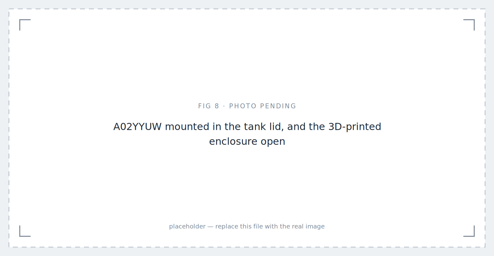
*A02YYUW mounted in the tank lid, and the 3D-printed enclosure open — placeholder image.*

We used the **A02YYUW** — a waterproof ultrasonic ranging module with a UART output. Waterproof was non-negotiable: both tanks are outdoors, and the sensor sits in a humid tank headspace. The node enclosures are **3D-printed and sealed**, since the whole assembly lives outside in tropical weather.

Ultrasonic in a tank has a reputation for problems — condensation on the transducer, foam, echoes off the tank walls, readings jumping around near the surface. So we tested in three escalating stages:

1. **In a glass** — smallest possible container, worst case for wall echoes and the sensor's blind zone
2. **In a bucket** — realistic geometry, still on the bench where we could measure the true height by hand
3. **In the actual water tower** — real tank, real water, real weather

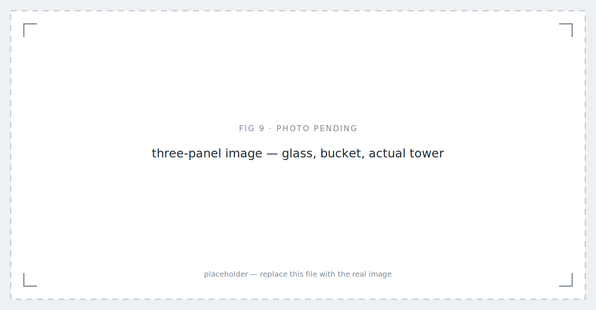
*Escalating validation. Each stage could have killed the sensor choice; none did. — placeholder image.*

It read the height accurately at every stage, with no issues we had to engineer around. That is a genuinely boring result and I'm glad to report it, because it means the sensor choice was correct rather than merely survivable.

## Detecting the flood

The flood side uses a **float sensor**, and the interesting part is not the sensor. It's the hole.

We dug a pit into the porch for this system, sized to house the pump and the float sensor together. When the porch floods, water runs into the pit before it accumulates meaningfully on the porch surface, and the sensor triggers when the pit fills to the top.

Digging came before any firmware, and it was the right order. No amount of sensor selection would have fixed detection on a flat porch.

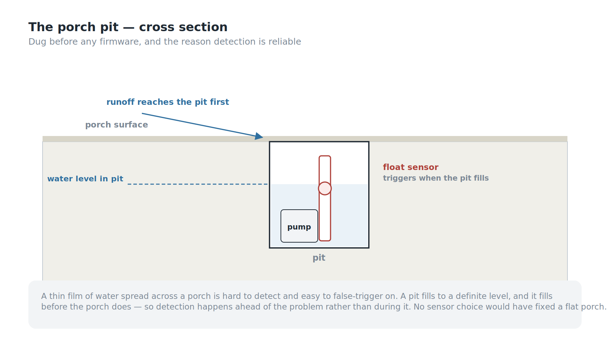
*The pit fills before the porch does. That head start is the whole detection strategy.*

This does two things that a sensor lying flat on the porch could not:

- **It concentrates the signal.** A thin film of water spread across a porch is hard to detect reliably and easy to false-trigger on. A pit fills to a definite level.
- **It buys time.** The pit fills before the porch does, so detection happens ahead of the actual problem rather than during it.

The pump was already there. I didn't specify it — it's the pump my family has always used for exactly this job, and reusing it was deliberate. It's the appliance the household already trusts.

**Control logic.** When the sensor detects flooding for the first time, the pump turns on automatically. When the sensor no longer detects water, it turns off. The rule lives in the **wall panel**: it receives the flood reading, decides, and publishes the pump command. The actuator node only does what it's told. The user can also operate the pump manually from the panel at any time. An explicit manual/automatic mode selector is still in development — right now automatic behaviour and manual override coexist, and making that a deliberate user choice rather than an implicit one is the next thing to fix.

## Two problems, two clocks

The panel refreshes every 10 seconds. I picked that number for no particular reason, and writing this article is what made me realise it deserved one.

A 500-litre tank takes a long time to fill. Ten seconds is far more often than anyone needs.

A flooding porch does not work on that timescale. In heavy rain the pit can go from dry to full quickly, and — more importantly — **the panel only helps if someone is standing in front of it.** The tank problem is a *monitoring* problem, and a wall panel solves monitoring beautifully. The flood problem is an *alerting* problem, and a wall display is the wrong shape for alerting. If it floods at 3 a.m., nobody is looking at the wall.

The automatic pump start covers the immediate need, which is why the system works in practice. But the honest framing is that Version 1 solved one of these problems and automated its way around the other. A flood event should push a notification, not wait to be looked at. That's V2.

## Getting the data where it needs to go

The tanks are about 20 metres from the panel and on a different floor, so the sensor nodes are wireless. But the distance isn't why the architecture looks the way it does.

**Nothing in this system talks to anything else directly.** Sensor nodes publish readings over MQTT to the broker. The panel subscribes and renders them. When someone presses a button on the panel — or when the panel's own rule decides the pump should run — the panel does not switch anything. It publishes a command back to the broker, and a separate actuator device subscribes to that command and drives the hardware.

The panel decides; it never touches the hardware. That split buys real things: the panel can be moved, replaced, or rebuilt without touching a single actuator, and a second panel or a phone client could be added tomorrow without changing anything downstream. It also has a cost, which I'll come back to.

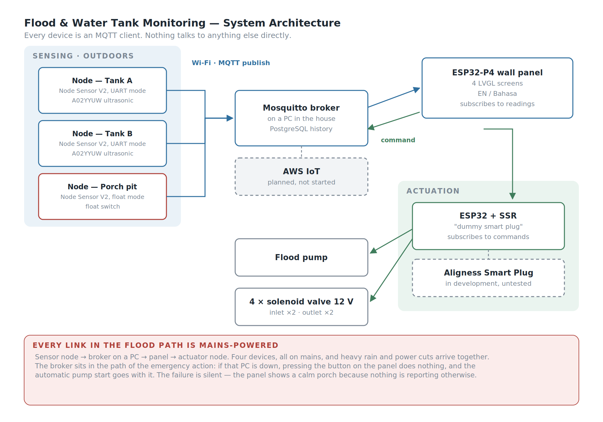
*Every device is a client of the broker. Convenient — until you notice the broker is in the path of the emergency.*

The broker is **Mosquitto**, running on a PC in the house, and readings are written to a **PostgreSQL** database — so the system has real history, not just live values. That matters more than it sounds: a tank level over time tells you the household's consumption rate, and a consumption rate is what turns "the tank is at 20%" into "you have about four hours."

Here is the cost I flagged earlier. Because nothing talks directly to anything else, **the broker is in the path of every action, including the emergency one.** If that PC is off, or updating, or has simply crashed, pressing a button on the panel does nothing at all — and the flood pump's automatic start goes with it. A general-purpose computer sits in the critical path of a safety function.

Migrating to **AWS IoT** is planned but not started. It would move the broker off my hardware and off my responsibility, and open the door to push notifications without building them from scratch. It would not fix this, though — it would move the single point of failure from a PC in my house to an internet connection, which during a storm is not obviously an improvement.

## The three-week fight with TLS

This is the section I'd most want to read if someone else had written it, because there is very little written about it anywhere.

Encrypting MQTT with TLS on the ESP32-P4 should be routine. It was not, and the reason is architectural: **the P4 has no radio of its own.** WiFi comes from a companion ESP32-C6, connected over SDIO and running the ESP-Hosted stack. Every network byte crosses a hardware bus between two chips. That bus turned out to be the choke point for everything.

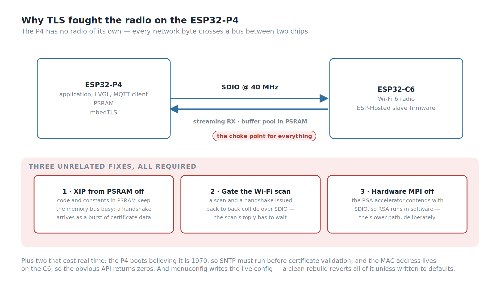
*Three unrelated fixes, all of them required before a certificate would validate.*

**The first trap is version matching.** The C6 slave firmware and the P4 host firmware have to be the same version. Updating the dependency file only updates the host — the C6 has to be flashed separately, over SDIO. And the intuitive fix, pinning the host *down* to match an older C6, is actively destructive: it changes where the transport buffer pool lands in memory and produces a memory-allocation boot loop. The correct direction is always to bring the C6 up, never the host down.

**Then the transport needs tuning.** The SDIO clock has to run at 40 MHz rather than 20 — technically off-spec, and stable in practice where the slower setting was not. Streaming RX mode has to be on, or the host and slave disagree about the transfer mode and abort. And the ESP-Hosted buffer pool has to be moved into PSRAM, or internal RAM runs out during boot.

**Then TLS itself crashed the system,** and this took three unrelated fixes, all of them required:

1. **Turn off execute-in-place from PSRAM.** With code and constants living in PSRAM, the memory bus is already busy — and a TLS handshake arrives as a burst of certificate data. The two contend.
2. **Gate WiFi scanning behind the MQTT connection.** A network scan and a TLS handshake issued back to back collide over SDIO. The scan simply has to wait.
3. **Turn off the mbedTLS hardware MPI accelerator.** This is the one nobody would guess. The RSA hardware engine contends with SDIO, and the fix is to do RSA *in software* — deliberately choosing the slower path because the fast one fights the radio.

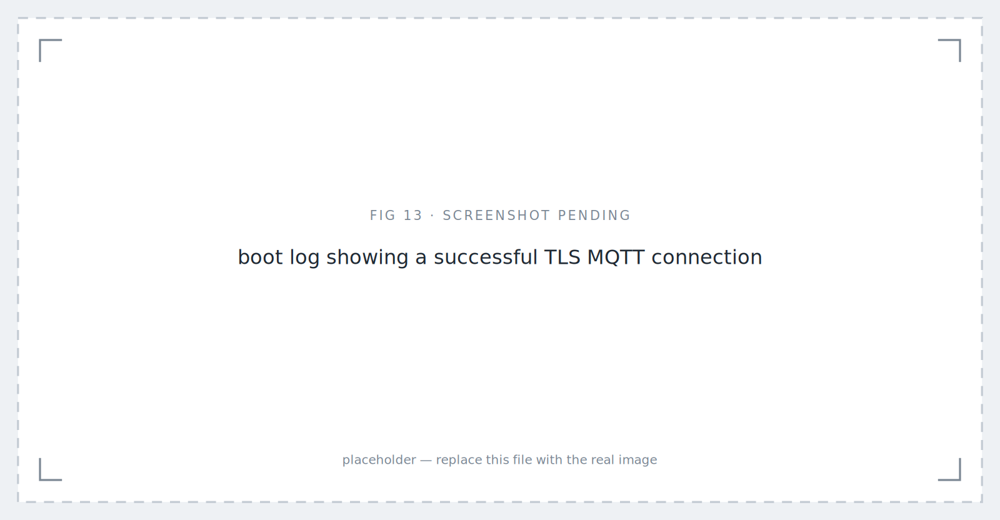
*After three weeks, four lines of log. — placeholder image.*

Two smaller things that cost real time. The P4 boots believing it is 1970, and TLS certificate validation fails without a valid clock, so **SNTP is mandatory** before the first connection. And the device's MAC address lives on the C6, not the P4, so the obvious API returns zeros — you have to ask the WiFi interface for it.

**And one meta-lesson that cost more time than any single bug:** `menuconfig` writes the live configuration, but a clean rebuild regenerates it from the defaults file. Every one of the settings above will silently revert on your next full rebuild unless you write them back to the defaults. I lost a working system to that more than once before it stuck.

## Letting the panel boot badly

One more thing worth writing down.

The touch controller on this board intermittently fails to answer its first read at cold boot. The board support package treats that as fatal and aborts, which means the panel boot-loops — no display, no WiFi, no data, because a touchscreen sensor was slow to wake up.

I overrode that. The initialisation now logs a warning and continues. On a boot where touch fails to come up, the panel still starts: **the display works, WiFi connects, MQTT connects, and the tank levels are visible.** You just can't touch it until the next reboot.

That is a strictly worse system than one where touch works. It is enormously better than a black screen. A monitoring system that shows you the water level but won't take input is still doing most of its job; one stuck in a boot loop is doing none of it.

## The failure mode I didn't design for

Here is the thing I noticed while writing this article, which is a good argument for writing them.

The sensor nodes run from mains adapters. The flood node lives in a pit on the porch, and its job is to detect flooding during heavy rain.

Heavy rain and power cuts arrive together. That is not a rare coincidence here — it is close to the normal case.

And it isn't just the sensor. Trace the flood path end to end: the float sensor node publishes to a broker running on a PC, the panel subscribes, the command goes back through the broker, and an actuator node switches the pump. **That is four mains-powered devices in a chain, and a storm outage takes all four at once.** And because the automatic rule lives in the panel, the panel has to be up for the pump to start by itself — a working sensor and a working actuator are not enough on their own. The single most urgent function in the system depends on the whole house having electricity, at exactly the moment the house is most likely not to.

Worse, the failure is silent. The panel would show a calm porch, because nothing would be reporting otherwise — and an absent alarm looks identical to an all-clear.

Battery power for the nodes was already on the list as a convenience item — fewer adapters, easier placement. It isn't a convenience item. And on its own it isn't even sufficient: a battery-powered sensor that can still reach a dead broker has only moved the failure one link down the chain. The honest fix is a local path — the flood sensor and the pump able to agree with each other without the broker, with the broker used for reporting rather than for deciding.

## What's built, and what isn't

**Running today:** the panel is mounted and in use. Both tanks are measured continuously. The porch pit is monitored. The flood pump starts automatically on detection and stops when the water clears, and can be driven manually from the panel.

Water routing uses **four 12 V solenoid valves** — one inlet and one outlet per tank. That covers both halves of the original tank problem: which tank is being filled, and which tank is feeding the house. Both were previously a person standing at a faucet.

The switching itself is done by an **ESP32 driving solid-state relays**, subscribed to the command topic. This is a placeholder, and it's worth being honest about what it's a placeholder for. The intended actuator is the **Aligness Smart Plug**, a device we're developing separately — but it isn't finished or tested, and putting an untested board in charge of a flood pump in my own house was not a trade I was willing to make. So the current actuator is a bare ESP32 and SSRs doing the smart plug's job on the same MQTT topics: a dummy smart plug, deliberately boring, replaceable the day the real one earns its place.

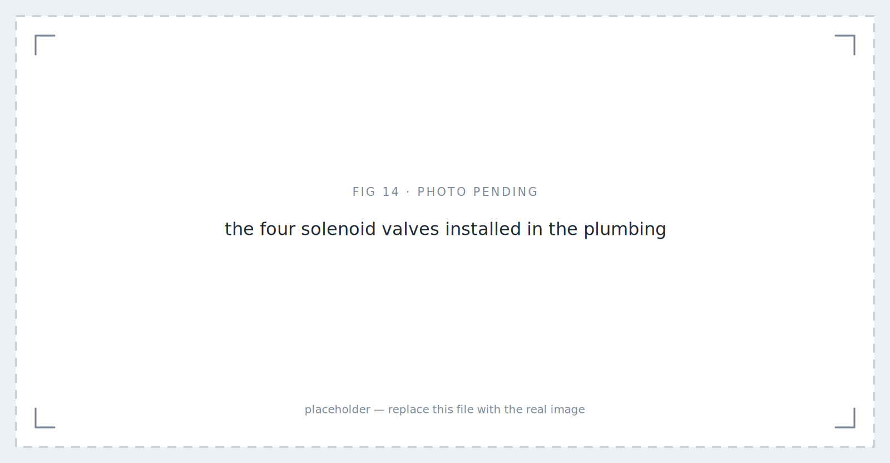
*The four solenoid valves installed in the plumbing — placeholder image.*

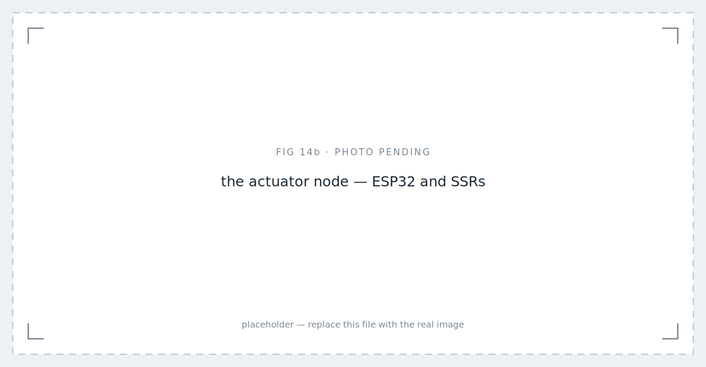
*The actuator node — ESP32 and SSRs — placeholder image.*

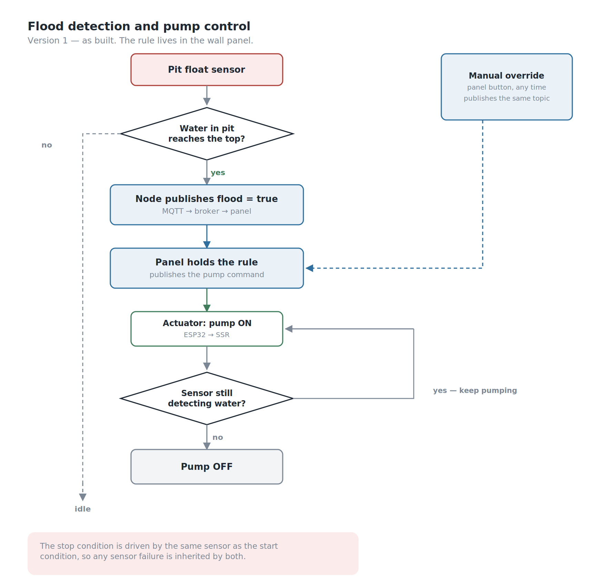
*As built. The stop condition trusts the same sensor as the start condition.*

**Still in development:** an explicit manual/automatic mode selector, so the operating mode is a decision the user makes rather than a behaviour they discover. Battery power for the sensor nodes. Swapping the dummy actuator for the Aligness Smart Plug once it's tested. The migration from the in-house PC broker to AWS IoT. And notifications, which the flood side genuinely needs.

The panel is running while we keep improving it, which is the honest state of most systems that live in a real house.

## SWOT Analysis

*SWOT graphic, matching the style used in the other two articles — placeholder image.*

**Strengths.** The system is designed around its actual operators rather than around the technology, and the wall-panel decision follows directly from that instead of from preference. An existing in-house sensor node board covered both sensor types, so the project spent its effort on integration rather than on PCB revisions, and any spare node fits any position in the system. Tank measurement gives real height rather than a full/not-full bit, which makes rate-of-change visible. The flood pit concentrates and time-shifts the signal, giving both a cleaner detection and a head start. Sensor node enclosures are sealed and 3D-printed for permanent outdoor service. The panel degrades to a functioning read-only display rather than boot-looping when touch initialisation fails. And the ultrasonic choice was validated in three escalating stages rather than assumed.

**Weaknesses.** The flood problem is an alerting problem being solved by a device that requires someone to be looking at it. The 10-second refresh serves both problems identically despite their very different urgencies. The broker runs on a household PC, making a general-purpose computer a single point of failure for the whole system. There is no explicit user-facing mode selection yet, so automatic and manual behaviour coexist without the user ever choosing between them. The flood pump's automatic stop is driven by the same sensor that starts it, so the shutdown condition inherits any failure in that sensor. The entire flood chain — sensor node, broker, panel, actuator — is mains-powered and routed through a single PC, making it vulnerable to exactly the storms it exists to detect, and its failure mode is silent. And the actuator is currently a stand-in for a device that has not been finished.

**Opportunities.** A local decision path between the flood sensor and the pump would take the broker and the panel out of the safety-critical loop while leaving them in charge of reporting and manual control. Migrating to AWS IoT brings notifications and history without building either, and removes the household PC from the critical path. The PostgreSQL history is already being collected, so predicting a dry tank from the household's consumption rate is a query away rather than a new subsystem. Decoupling the two refresh rates is a small change with real benefit. And the panel has considerably more display and compute than this system uses — it can absorb more of the house without new hardware.

**Threats.** The main risk is the same one every home system faces: if my parents stop using it, it does not matter how well it works. Outdoor sensors in tropical weather degrade, and a slowly drifting ultrasonic reading is more dangerous than one that fails outright, because nothing announces it. And the ESP-Hosted stack this panel depends on is evolving quickly — the configuration described above is stable today and is not guaranteed to survive an upgrade unattended.

## Conclusion

Measured against what I set out to do:

1. **Made both tanks continuously visible in one place**, in real height rather than a binary status, removing the need to physically climb up and look.
2. **Automated both the filling switchover and the outlet selection** with four solenoid valves controlled from the panel, replacing a manual faucet juggle that required someone to be watching.
3. **Detected flooding early and started the pump automatically**, by putting the sensor in a pit that fills before the porch does.
4. **Built an interface my parents will actually use** — which, for this project, was the requirement everything else served.
5. **Built the whole system as MQTT clients around a broker**, so the panel, the sensors, and the actuators can each be replaced without touching the others — at the price of putting the broker in the path of everything, including the emergency.
6. **Did not solve alerting**, and Version 1 automated its way around that gap instead of closing it.

The lesson I'm taking from this one is about the users. Every technical decision here — the wall panel, the always-on display, the physical buttons, the light-switch form factor — traces back to a single fact about two people who were never going to open an app. It would have been faster to build the app. It would also have been an unused app.

The hardest constraint in this project was never the sensors or the TLS stack. It was designing for people who did not ask for a smart home and do not want one. They want the porch dry and the tanks full.

**Flood & Water Tank Monitoring: Version 1** does that. Version 2 has to make it tell them.

---
