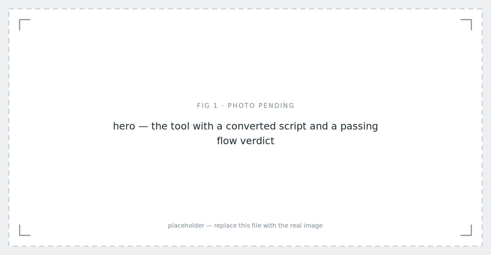
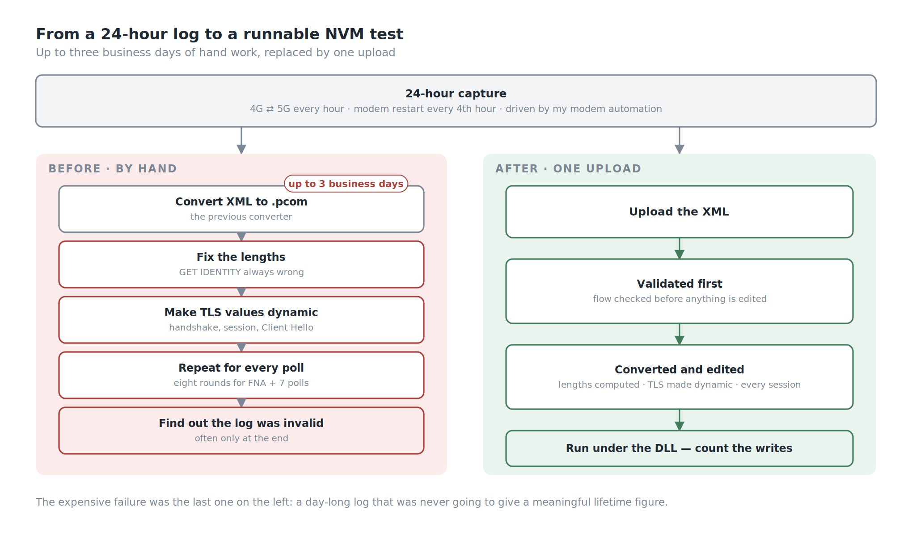
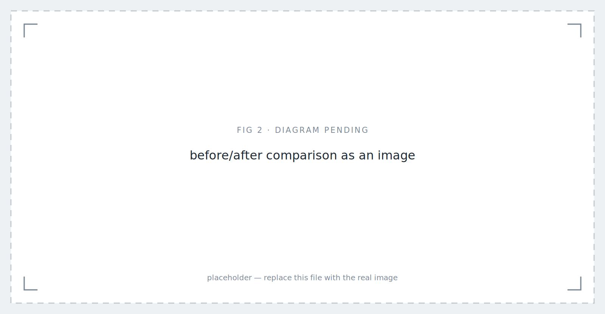
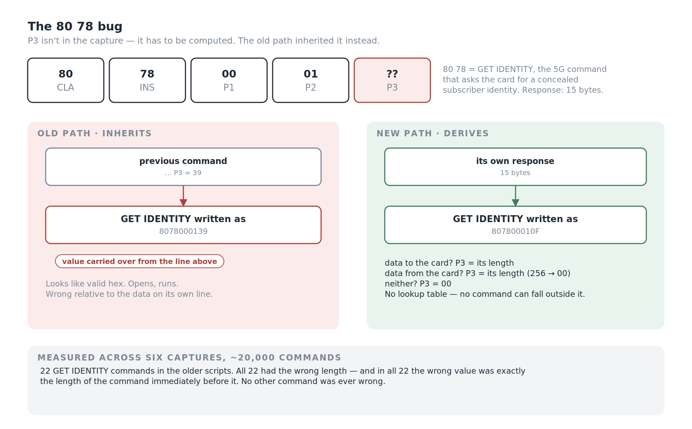
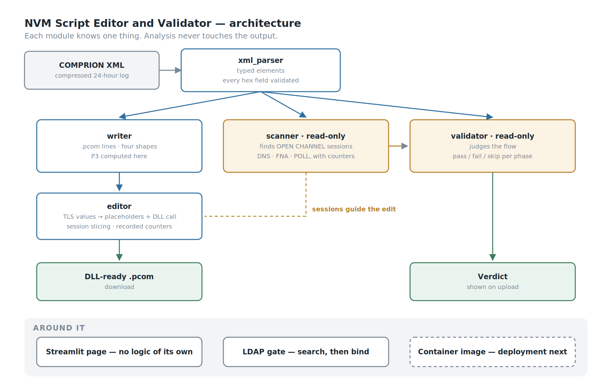
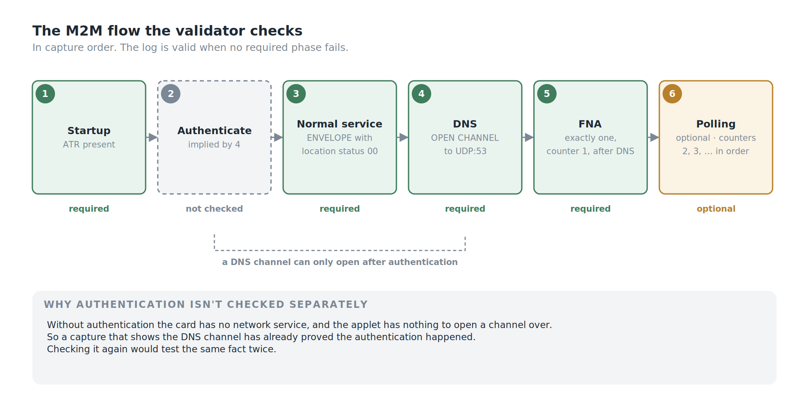

*NVM Script Editor and Validator: Version 1.0.0 — placeholder image.*

## Background

A SIM card has a finite life, and it is measured in writes.

The memory inside a card can only be written and erased so many times before a cell wears out. So one of the things we have to know about a product, before it goes into a device that might sit in a water meter for ten years, is how many write and erase cycles it actually performs in normal operation — and therefore how long it will last. That is an **NVM test**, and its output is a product lifetime figure.

To get that figure you need a realistic recording of the card doing its job. Ours comes from a freshly personalised card running for **24 hours**, in a scenario that switches between 4G and 5G once an hour, with the modem restarting every fourth hour. A full day of a card behaving like a card in the field.

That day is driven by another tool I built — modem automation that steps through the whole scenario over AT commands, unattended, so a 24-hour run doesn't need anyone awake to switch networks. One tool produces the log. This one consumes it.

At the end of that day you have a log. What you do not have is a test.

To count the writes, the recorded session has to be replayed against the card through a **DLL** that simulates the card's flow and counts what it writes. Which means the log has to become a runnable script: compress the log, convert the XML into a `.pcom` file with a conversion tool, and then — by hand — edit that file until it will actually execute under the DLL.

That hand-editing is where the time went.

## Three Problems, Every Time

The same three things went wrong on nearly every run.

**1. The conversion got lengths wrong.** Data length calculations came out incorrect, or data was corrupted on the way through. A file that looks complete and is subtly not.

**2. The recorded TLS values are single-use.** The handshake material, the TLS session, the Client Hello — all of it is random, generated once, for that session. Replaying the recorded bytes cannot work. Every one of those values has to be replaced with something dynamic so the DLL can negotiate live when the script runs, rather than reciting a conversation that has already ended.

**3. The log was often invalid, and you only found out later.** An M2M product has an expected flow: authenticate, open a DNS channel, then the first admin session. What the capture actually contains is sometimes not that. So you would spend hours preparing a script from a log that was never going to produce a meaningful lifetime figure, because the session it recorded wasn't the session the product is supposed to have.

Together these could take **up to three business days** to work through, per NVM run, before the test itself had started.

Three days of a qualified tester hand-editing a file so that a machine could read it.

*Three days of hand preparation, replaced by one upload.*

## My Role

- **Ega Guntara** — everything: architecture, parser, writer, scanner, validator, the script editor, LDAP authentication, containerisation

Built solo.

## Case Study

Some ground to cover, because none of this is common knowledge outside card testing.

A card speaks in **APDUs** — command and response pairs, a few bytes each. A capture records them in order, along with resets, the ATR the card presents at power-on, and protocol negotiation. A `.pcom` script reproduces that conversation line by line: each command as its header, the data going to the card, the data expected back, and the status word that should conclude it.

Converting one into the other sounds like reformatting. It isn't, for one reason: **the capture does not contain everything the script needs.**

The clearest case is the length byte — **P3**, the fifth byte of every command header, which states how many bytes are involved. The capture doesn't record it. It records the data. So the converter has to *compute* P3 from what it can see, every time, for every command.

That is where problem 1 lives.

| | Before | With the tool |
|---|---|---|
| Preparation per NVM run | up to 3 business days | one upload, one click |
| The length byte | wrong for one command, every time | computed from the data |
| TLS and handshake values | hand-edited to be dynamic | transformed automatically |
| Whether the log is usable | discovered late, by hand | checked on upload |
| Session structure | read by eye | scanned and classified |

*Before/after comparison as an image — placeholder image.*

## Problem 1 — The 80 78 Bug

Before this tool, captures were converted with the previous converter. It worked for almost everything. It had one blind spot, and the blind spot is worth describing exactly, because it's the kind of defect that survives for a long time.

**The command.** `80 78` is **GET IDENTITY** — a command added for 5G so the device can ask the card to produce a concealed form of the subscriber's identity rather than the identity itself. It is newer than most of what a card handles, and it matters here because 5G registration uses it — and our 24-hour scenario switches into 5G every other hour.

**The bug.** When the old converter wrote a GET IDENTITY line, it didn't compute the length byte. It reused the length of **the command right before it**. So a GET IDENTITY whose response is 15 bytes — which should be written `807800010F` — would come out as `8078000139`, or `807800010C`, or `8078000100`, depending on whatever happened to precede it.

**How it surfaced.** Not by inspection. A script produced by the old converter was run under the DLL, and it failed — on the GET IDENTITY line, with a status word saying the length was wrong. The card itself was the thing that disagreed. That pointed at one line in one script; the next question was whether it was one line or a pattern.

**How big it was.** Comparing the tool's output with the scripts previously produced from the same captures, command by command, across six captures and roughly **20,000 commands**:

- the two agree on the length byte everywhere except **22 lines**;
- **all 22 are GET IDENTITY** — there are 22 GET IDENTITY commands in those captures, so every single one was wrong;
- and in **all 22 cases**, the wrong value is exactly the length of the command immediately before it.

That last point is what turns a suspicion into a diagnosis. It isn't noise and it isn't corruption. It's a value left over from the previous line, every time, for one command and no other. The most likely reason is that the older tool simply didn't know GET IDENTITY — a 5G-era command it had never been taught — and fell through to whatever it had last computed.

**Why nobody saw it earlier.** Nothing about the output looked wrong. Every byte was plausible hex, the line had the right shape, the file opened. The error only exists relative to the data on the same line — and nobody reads a 20,000-command script checking each length against its own response. The wrong script and the right script look identical until a card disagrees with one of them, which is exactly how this one was caught.

*The old path inherited the previous command's length. The new one derives it from the command's own data.*

**The fix** is one small function in the writer, and it's short enough to state in full:

- If the command sends data to the card, P3 is the length of that data.
- Otherwise, if the command expects data back, P3 is the length of the response — with 256 bytes written as `00`, which is the convention.
- Otherwise, P3 is `00`.

No lookup table of known commands, so no command can fall outside it. GET IDENTITY with a 15-byte response becomes `807800010F` because the response is 15 bytes — not because the tool was told about GET IDENTITY. That bug is one of the reasons the writer computes P3 at all rather than trusting anything it's given.

Bench-tested on physical cards, the scripts the tool generates proved **more accurate than the hand-edited reference scripts** they were compared with.

## Building the System

The application is a **Streamlit** page with the conversion logic in separate modules underneath. The structure follows the three problems directly: one module computes lengths correctly, one transforms the TLS material, and one decides whether the log was worth preparing in the first place.

*Each module knows one thing. Analysis never touches the output.*

Each module knows one thing and nothing else.

**The parser** understands the XML and has never heard of `.pcom`. It turns the file into ordered, typed objects — commands, resets, the ATR, protocol negotiation, and a catch-all for tags it doesn't recognise — validating every hex field on the way in. Anything malformed fails here, at the boundary, rather than producing a script that fails mysteriously later.

**The writer** understands `.pcom` and has never heard of XML. It renders each element as a line, choosing between four shapes depending on whether the command carries data, expects data, both, or neither. The spacing in those four cases was verified character by character against real tool output, because a perso script is consumed by a machine that cares.

This is also where P3 is computed. The reason the fix is four lines rather than a patch scattered across the codebase is that exactly one module is responsible for what a `.pcom` line looks like.

**The scanner** is read-only. It walks the same parsed elements looking for the moments where the card asks the terminal to open a network channel, and classifies each one. It never touches the output — analysis and generation are kept apart on purpose, so a mistake in understanding a session can't corrupt the script.

Classifying those sessions means reading structure that is nested three deep: a proactive command lives inside a response, the command type lives in a tag within it, the transport and destination live in further tags, and the session's own identity — whether it's a first connection or a later poll, and which number it is — lives in the HTTP request that follows, encoded as text inside a query value. Readable, once you know it's there. Invisible if you don't.

**The validator** is problem 3, and it is the module that changes what the tool *is*.

It takes the elements and the sessions and judges them against what the product's flow is supposed to look like. For M2M: the card powered on and presented an ATR; it reported normal service; it resolved a hostname; it made exactly one first connection, numbered one, after that resolution; and any later connections are polls, numbered in sequence. Each phase returns pass, fail, or skipped, and the capture is valid when nothing required failed.

*The verdict arrives on upload, before anyone edits anything.*

A converter turns a capture into a script. A converter that also tells you the capture doesn't match the expected flow has saved you the work of preparing it — and that was the most expensive failure in the old process, because an invalid log looked exactly like a valid one until late.

**Authentication isn't checked directly, and doesn't need to be.** The card can only open a channel once it has authenticated and has network service; without authentication, the applet has nothing to open a channel over. So a capture that shows the DNS channel has already proved the authentication happened. Checking it separately would test the same fact twice.

**The editor** is problem 2. A recorded secure session cannot be replayed — the handshake, the session material, the Client Hello are all random values belonging to one conversation that has already finished. Replaying them produces a script that fails in a way that looks like a card fault.

So the recorded bytes are replaced with placeholders and a library call, and the open channel schema is rewritten so the script negotiates live when it runs. This is the part that used to be done by hand, on every file, and it's the part where a mistake is least visible: a wrong byte in a handshake doesn't announce itself as a wrong byte, it announces itself as a session that won't come up.

No single piece of the editor was the hard part. The DNS channel sequence, the session slicing and the counter each took about the same effort, which is its own kind of lesson: the difficulty was in getting all of them right at once.

## Multiple Sessions In One Capture

A capture with one connection is the easy case. A capture with a first connection followed by seven polls isn't harder — it's longer. Nothing broke. The edits a tester had to make for one session had to be made again for every poll, by hand, and seven polls meant eight rounds of the same careful work.

Session slicing is what turns that into a loop: the capture is cut into its sessions, and each one gets the same transformation automatically.

The counter needed more thought. Each admin session carries a counter, and it would be natural to generate the sequence — first session is one, next is two. But generating it isn't an option. The job is to reproduce **a real card, as it behaved during that recording** — so the counter has to be whatever that card's state actually was at the time. The tool reads it out of what was recorded rather than inventing it.

A generated counter would give a script that is internally tidy and wrong about the card. A recorded one gives a script that matches what really happened.

## Verify Every Increment

This is the section I care most about, and it is not about card testing.

I built this strictly one increment at a time. Each increment added one small piece, and nothing moved forward until its output was verified **byte-exact** against a reference. Not "looks right." Not "the script runs." Byte for byte, compared and confirmed, before the next piece was allowed to exist.

It is slower. It is noticeably, frustratingly slower, and there were points where the next step was obvious and I made myself verify the current one anyway.

Here is what it bought.

**It's what turned one failure into a fix.** The DLL told me one line was wrong. It couldn't tell me whether that was one line or a pattern. Checking every line against its own data is what showed it was every GET IDENTITY, in every capture — and it's what guarantees no command can drift back to an inherited value. That kind of defect is invisible to anyone checking whether a script *looks* right; it only appears when each line is checked against its own data, which nobody does by eye across 20,000 commands.

**And it changed what the output is worth.** The scripts this tool generates were bench-tested against physical cards, with both a single-session capture and a multi-session one. They work, and they work because every transformation between the capture and the script was checked rather than assumed.

For a tool that generates test material, that distinction is the entire value. A test script you're not sure about is worse than no test script, because it produces results you'll believe.

## Authentication, and Why It Isn't Deployed

Company policy requires every deployed web service to authenticate, so the tool has an **LDAP gate** against the corporate directory: a read-only lookup to find the account, then a bind as that user to check the password, over LDAPS.

One detail worth mentioning because it's the kind of thing that bites.

A failed lookup and a rejected password are handled as **separate errors**. That sounds pedantic. It isn't: if the code treats them the same and retries against the second directory, a user who mistypes their password gets two failed binds instead of one — and enough of those locks their corporate account. A retry loop written without thinking about it becomes a way to lock your colleagues out of everything.

**And the tool is not deployed yet.** It's at version 1.0.0 and in daily use: colleagues clone the repository and run it themselves. Containerisation is done; deployment is waiting because my manager asked for more features first, and those land in 1.1.0.

I'm aware of the irony. Two of my other tools exist precisely to stop people maintaining their own local copies of a toolchain, and this one currently asks them to. Deploying it removes that — which is why it's the next step rather than an optional one.

## What's Built, and What Isn't

**Working:** capture to script conversion with correct length computation; session scanning and classification; M2M flow validation with per-phase results; the TLS-PSK transformation; LDAP authentication; a container image.

**Not yet:** deployment behind a reverse proxy; more than one product in the validator — M2M is the only flow it knows; and the 1.1.0 features.

## SWOT Analysis

**Strengths.** The length byte is computed from the data rather than looked up or inherited, so no command — including one the tool has never seen — can fall through to a stale value. Module boundaries are strict enough that the fix was four lines in one place. Analysis is separated from generation, so understanding a session can't corrupt the output. The validator turns a converter into something that judges a capture before anyone spends time on it. Counters are read from the recording, so the output stays faithful to the real card. And the whole thing was verified byte-exact and bench-tested against physical cards.

**Weaknesses.** One product flow. Not deployed, so everyone runs their own copy from source. Built by one person, so the domain knowledge — which tag means what, why the spacing matters — is concentrated in one head and one README.

**Opportunities.** The validator is the extensible part: more products, more flows, the same structure. A tool that already reads sessions and counters could compare two captures rather than convert one. And because conversion is now trustworthy, it could run unattended rather than as an upload-and-download.

**Threats.** The capture format belongs to a vendor, and a format change is a change I have to follow. And scripts produced the old way still exist; any of them made from a 5G capture carries the same stale length on every GET IDENTITY.

## Conclusion

Against what I set out to do:

1. **Collapsed up to three business days of preparation into one upload**, so a tester who finishes a 24-hour capture can start the actual NVM test the same afternoon.
2. **Computed the length byte from the data**, removing a defect that made every GET IDENTITY line in the older scripts wrong.
3. **Made the tool judge as well as convert**, so a capture that doesn't match the expected flow says so.
4. **Kept the output faithful to the real card**, including reading counters from the recording instead of generating them.
5. **Not deployed yet**, and it knows exactly one product flow.

The lesson is about references.

Every test setup has artefacts that have become authoritative through use rather than through verification. The known-good script. The file everyone copies from. Nobody decided it was correct; it just stopped being questioned, and everything downstream inherited whatever it contained.

A stale length byte survives exactly that way. Check a new script against an old one made by the same path and they agree — and agreement looks exactly like success. Check it against the capture, the actual record of what the card did, and the disagreement is right there on the line.

**The thing you check against has to be more trustworthy than the thing you're checking.** Where I work, that's the job description.

Version 1.1.0 is already on the list.

---
