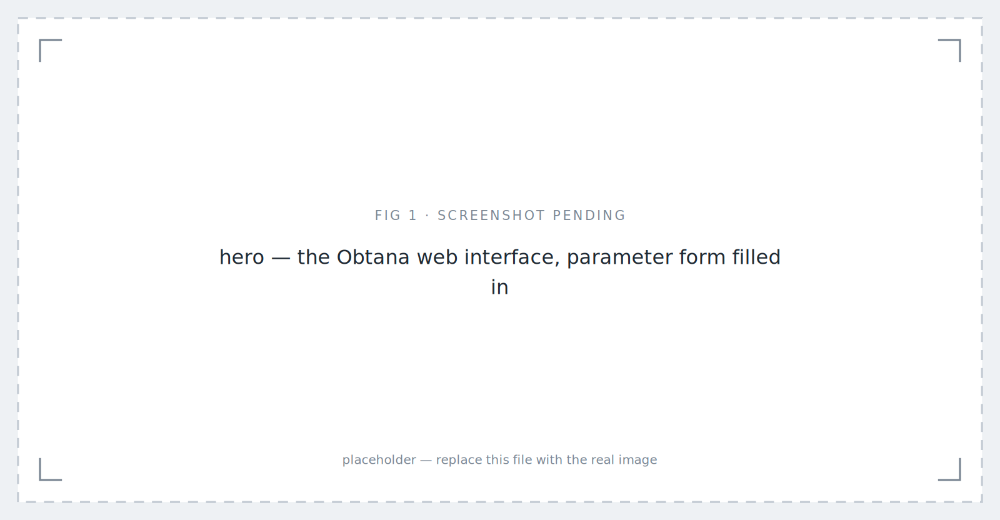
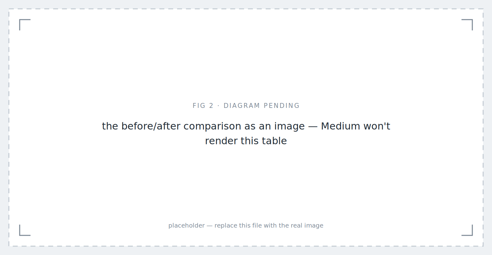
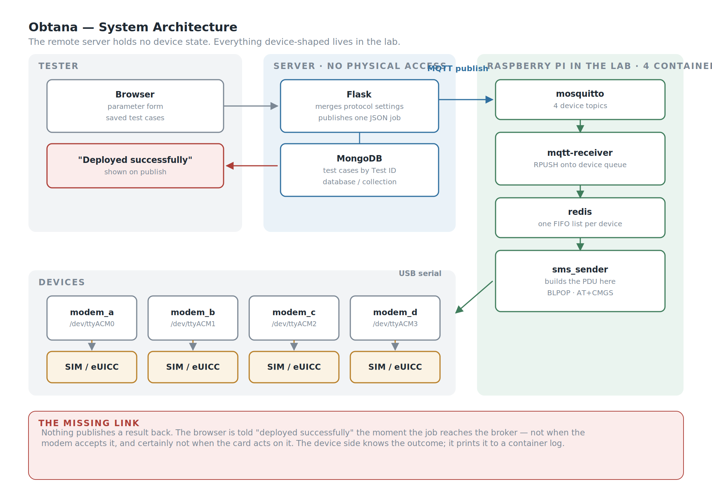
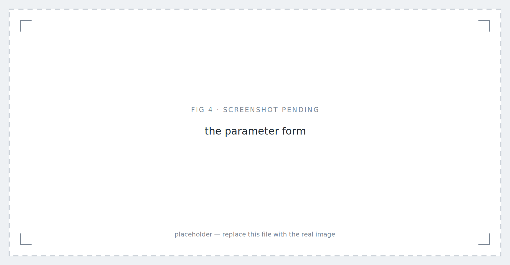
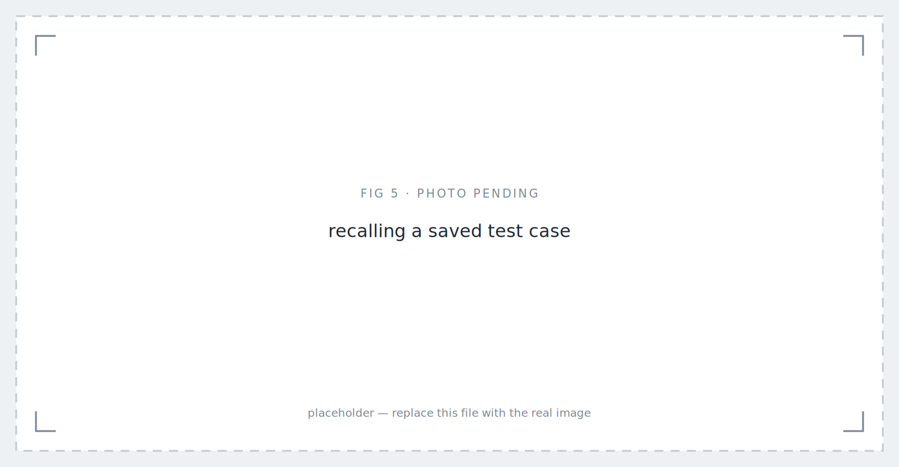
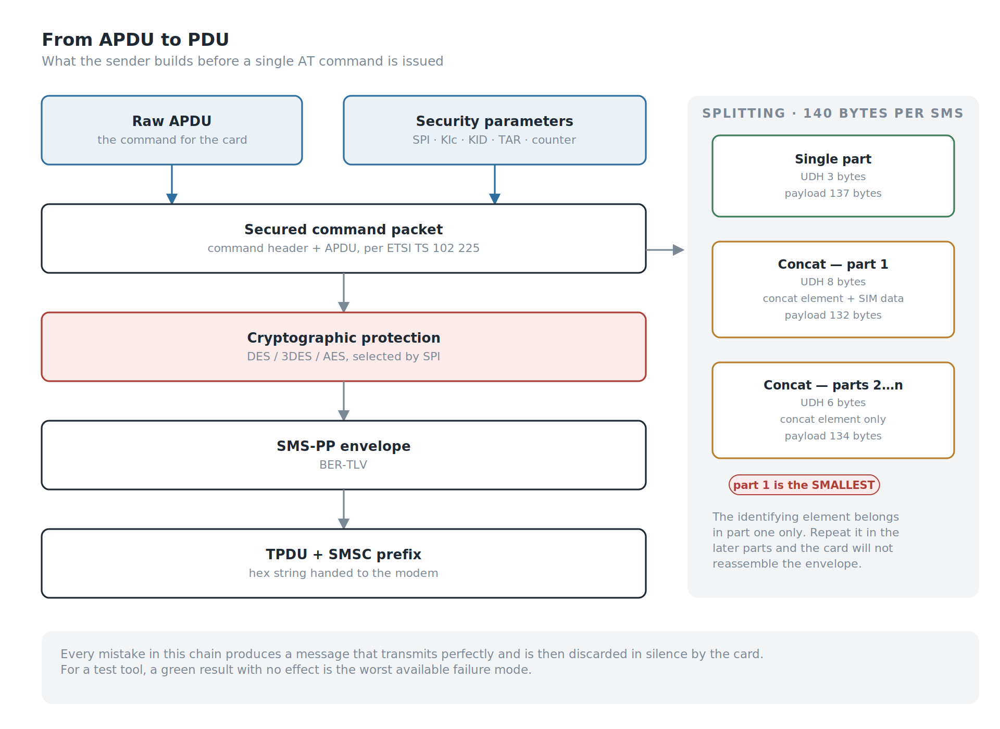
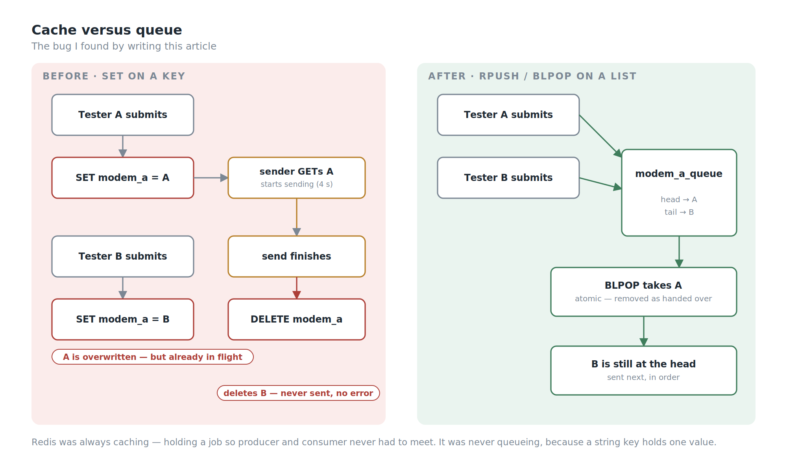
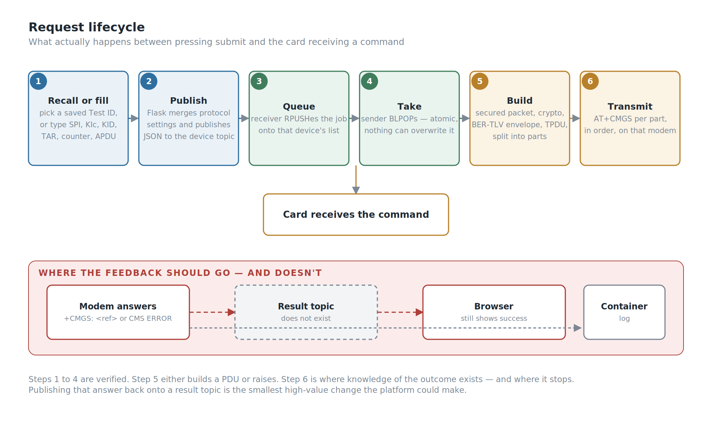
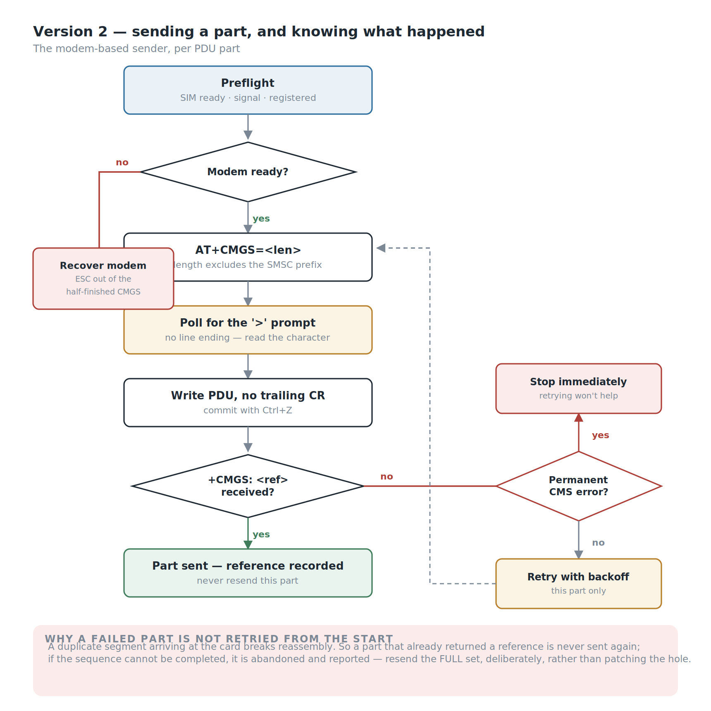

*Obtana OTA Test Platform: Version 1 — placeholder image.*

## Background

Every article in this series so far has been about building something that didn't exist. This one is about deleting something that did.

I test smart cards. A large part of that is **OTA testing** — sending a command to a SIM card over the air, wrapped inside an SMS, and checking that the card does what it was told. The mechanism is old, well-specified, and still everywhere: an APDU is wrapped in a secured command packet, that packet goes into an SMS-PP envelope, the envelope is sent as a binary SMS, and the card processes it without the phone ever showing a message.

To send that SMS you need a device that can transmit a raw PDU. In our lab that meant **2G handsets**, connected by USB, driven with AT commands.

We had four of them. We had six testers.

That ratio is the part of the story people notice, and it's the smaller half of the problem. Sharing a handset meant standing up, walking to someone's desk, and asking whether they were still using it. If they were, you waited. It was annoying, and it was survivable.

The expensive part was invisible from outside the team.

To run an OTA test, every tester needed a working local environment: **Python 3.5** — already obsolete — plus the company's internal library, the internal API dependencies, and **a USB driver for every handset model in the lab**, because the handsets came from different manufacturers and none of them agreed on anything. Six people maintained six copies of that stack. It broke often. And every time someone was issued a new PC, they rebuilt the whole thing from scratch and lost the better part of a day to it.

So the real problem was never the queue for a phone. It was that **the ability to run an OTA test lived on six individual laptops, in a form that was fragile, undocumented by construction, and quietly expiring** as Python 3.5 aged out from under it.

Obtana moved all of it to one place and gave everyone a browser instead.

## My Role

- **Ega Guntara** — everything: architecture, backend, envelope generation, web interface, device layer

I built the initial framework alone. A colleague has since taken over feature development; this article covers the version I built, developed over roughly six months in 2025.

## Case Study

To explain what the platform had to do, it helps to be precise about what an OTA test actually is.

A tester wants to send a command to a card — read a file, update a record, install something. That command is an **APDU**. Getting it to a card in a phone in someone's hand, rather than to a card sitting in a reader on the desk, means the following:

1. The APDU is wrapped into a **secured command packet**, carrying the security parameters that tell the card how the packet is protected: **SPI**, the key set identifiers **KIc** and **KID**, the **TAR** identifying the target application on the card, and a **counter** for replay protection.
2. That packet is encrypted and integrity-protected using the algorithm the parameters select — **DES, 3DES or AES**.
3. The result is packed into an **SMS-PP envelope** as BER-TLV structures.
4. The envelope is packed into a **GSM TPDU** and handed to a modem as a hex string.
5. The modem transmits it as a binary SMS to the target MSISDN.
6. The card receives it silently, processes it, and — if asked — replies.

Steps 1 through 4 are code. Step 5 is why we needed the handsets. **PDU mode** is what makes this possible: the ability to hand a modem a raw, fully-formed message rather than a piece of text. Ordinary phones and ordinary messaging paths won't carry this; the message has to arrive as the specific class of binary SMS the card is listening for, unmodified.

Before Obtana, all six steps happened on the tester's own laptop, against a handset physically plugged into it.

| | Before | With Obtana |
|---|---|---|
| Python 3.5 environment | on every tester's PC | on the server only |
| Internal library + API dependencies | on every tester's PC | on the server only |
| USB drivers per handset model | on every tester's PC | on the device host only |
| Rebuild after a PC refresh | ~a day, per person | none |
| Handset access | walk over and ask | request from a browser |
| Concurrent testers per handset | one | queued automatically |
| The four handsets | one per desk, borrowed in person | pooled, shared by everyone |


*The before/after comparison as an image — Medium won't render this table — placeholder image.*

## Workflow

There was one constraint that shaped the entire architecture, and it wasn't technical elegance. It was physical.

**The server is in a data centre I cannot walk to.** The web platform had to be deployed there, on managed infrastructure — but you cannot plug a USB handset into a machine you will never physically touch. Whatever ran the handsets had to live in the lab, near the devices, near me.

That splits the system in two, and forces a question: how does a web application on a remote server tell a device sitting in a lab to transmit an SMS?

The wrong answer is to have the server reach into the lab. That means an inbound path, an exposed port, a static address, firewall exceptions, and a lab machine that has to be addressable from outside — all of it fragile, and all of it requiring cooperation from people who have better things to do.

The right answer is to invert it. **The lab reaches out.**

The devices connect to a **Raspberry Pi** in the lab over USB serial, and the Pi runs the entire back half of the system as four Docker containers: an **MQTT broker**, **Redis**, a receiver that subscribes to the device topics, and the sender that talks to the modems.

The Flask application on the remote server does one thing with a submitted test: it publishes a JSON message to a topic. It holds no device state, opens no serial port, and knows nothing about what hardware exists in the lab.

That is the actual reason this system uses MQTT rather than HTTP calls into the lab. It isn't throughput — at a handful of OTA tests per hour, no messaging protocol on a LAN is a bottleneck. It's direction, and it's ownership. Everything device-shaped lives on hardware I can physically reach, in containers I can restart, and the machine I can't touch holds nothing that needs touching.


*The server publishes a description of a test and forgets it. Everything device-shaped runs in the lab, in four containers, on hardware I can reach.*

**One topic per handset.** Four handsets, four topics. Routing is addressing rather than logic — the server chooses a device by publishing to that device's topic, and each handset's listener only ever sees work meant for it. No dispatcher, no device-ID field to parse, no routing table to keep in sync with reality.

From this, four objectives:

1. **Remove the local environment entirely** — no Python, no internal libraries, no drivers on any tester's machine.
2. **Pool the handsets** so a device is a resource the platform allocates rather than something you negotiate for in person.
3. **Prevent two testers from colliding** on one handset.
4. **Keep the deployment possible** on infrastructure I have no physical access to, by putting everything stateful on hardware I do.

## Building the System

Five parts worth elaborating: the **parameter interface**, the **test-case library**, the **envelope builder**, the **hand-off**, and the **device layer**.

### The Parameter Interface

The web front end is **Flask**. A tester fills in the parameters of the secured packet — **SPI**, **KIc**, **KID**, **TAR**, the **counter**, the target number, the cryptographic algorithm, and the raw APDU to be delivered — chooses a handset, and submits.

Everything downstream of that form is the platform's problem.

This is worth dwelling on, because it's the actual product. The old workflow required a tester to have a correctly configured Python environment in order to express the sentence *"send this APDU to this card with these security parameters."* Obtana reduces that sentence to a form. The knowledge required to run an OTA test is now domain knowledge — what SPI means, what a TAR is — and no longer includes knowing why `pyserial` won't import.

Underneath the per-test parameters sits a second layer: the **protocol settings** — TP-PID, TP-DCS, the service centre timestamp, the SMSC number, and the first octets used for the submitted message and the envelope. These change per card profile rather than per test, so they aren't on the main form. They're uploaded as a **JSON file**, validated for required fields on upload, and merged into every test submitted afterwards.

That split matters more than it looks. Per-test parameters belong to the test; profile parameters belong to the campaign. Separating them means a tester changing card profile edits one file instead of six form fields on every single run.


*The parameter form — placeholder image.*

### The Test-Case Library

Typing SPI, KIc, KID, TAR, a counter and a payload correctly, by hand, every time, is exactly the kind of task humans are bad at — and a mistyped TAR produces a message that transmits perfectly and does nothing.

So parameter sets are saved. **MongoDB** stores complete configurations keyed by a **Test ID**, organised into databases and collections, and the web interface reads them back: choose a database, choose a collection, choose a test ID, and the form fills itself in. Saving upserts, so re-saving an existing ID updates it rather than duplicating it.

This is the feature that makes the difference between a sending tool and a test platform. A test that exists only as a sequence of hand-typed hex values isn't repeatable, isn't shareable, and isn't reviewable. A test that exists as a named record in a collection is all three. When someone asks "what exactly did we send to that card last month," there is an answer that isn't somebody's memory.


*Recalling a saved test case — placeholder image.*

### The Envelope Builder

This is the part that justifies the platform, and it is the part where being nearly correct produces something that looks completely correct and silently does nothing.

This runs **on the Pi**, not on the server — the sender container takes the parameter set and constructs the whole transmission itself: the secured command packet with its security header, the cryptographic protection applied according to SPI, the **BER-TLV** structures of the SMS-PP envelope, and the **TPDU** that carries it — built as either an **SMS-SUBMIT** (the form a phone sends to the network) or an **SMS-DELIVER** (the form the network hands to the card), because different test setups need different ones and the platform supports both. The output is a hex string handed straight to the modem.

Putting the builder next to the modem rather than next to the web form was deliberate. What crosses the network is a description of a test; what touches the serial port is the finished message. The server never has to know how long a PDU came out, whether it needed splitting, or how many parts went out.

A few things learned the hard way, all of which live in the gap between what the specification says and what actually gets delivered:

**Concatenation is asymmetric, and so are the chunk sizes.** An SMS carries 140 bytes, minus whatever the user-data header takes. A single-part envelope has a 3-byte header, leaving 137 bytes of payload. Split it, and the first part's header grows to 8 bytes — because it carries both the concatenation element and the element identifying this as SIM data download — leaving 132. Every subsequent part carries the concatenation element only, 6 bytes, leaving 134.

So the first chunk is *smaller than the ones after it*. That is not an obvious thing to arrive at by intuition, and getting it wrong produces parts that transmit cleanly and reassemble into rubbish. The identifying element belongs in **part one only**; repeat it in the later parts and the card will not put your envelope back together.

**And the length field is computed, not assumed.** The `AT+CMGS` length argument counts the TPDU only, excluding the SMSC prefix at the front of the PDU. Getting it wrong returns a generic `CMS ERROR` that names nothing useful, so the sender derives it from the PDU's own SMSC length byte rather than trusting a caller to get the arithmetic right.

Three more lessons are older than the server. They came from debugging the earlier desktop sender, and they're worth keeping here because they're the same kind of mistake:

**The data coding scheme is not cosmetic.** A DCS in the `0xFx` range and its `0x1x` equivalent can describe what looks like the same class of binary message, and both look legitimate on inspection. Only one reached the card as the class it was listening for, so the desktop tool normalised one to the other.

**How you hand the envelope over matters.** Submitting a fully formed envelope through the ordinary SMS path returned `CMS ERROR 330` — an unhelpful code that says nothing about which of a dozen things went wrong. Passing it to the card directly with `AT+CSIM` avoided the problem.

**Don't derive the concatenation reference from the counter.** Using the low byte of the OTA counter as the reference is convenient and looks deterministic. It also means two messages whose counters differ by exactly 256 collide on reassembly, so the desktop tool switched to a random reference. That one hasn't fully made it across: when a test doesn't supply a reference, the server still falls back to the counter's low byte. It's on the list.


*Every stage is a place where a perfectly transmittable message can be built that the card will silently discard.*

None of these produce an error at the point of the mistake. Each one produces a message that transmits successfully and is then silently discarded by the card, which is the worst possible failure mode for a test tool: **a green result and no effect.**

### The Hand-off

A modem is not a shared resource in the way a web server is. It is a single serial device that can be in the middle of exactly one `AT+CMGS` transaction at a time, and a multi-part envelope holds that device for several seconds.

If two testers submit against the same device at once, the second arrives while the first is still transmitting. The failure that produces is not a clean rejection.

**Redis** sits between the two halves as the hand-off point. The receiver container writes an arriving job under that device's key; the sender container polls, picks it up, builds the PDU, transmits, and clears it. Decoupling them this way means a slow send never blocks message reception, and the sender can be restarted without losing what the broker already delivered.

And for a long time, that is all it did — which brings me to the part of this article I did not plan to write.

**Redis was caching. It was not queueing, and I thought it was.**

The distinction is the whole bug. Caching means holding a value so the producer and the consumer never have to meet; a Redis string does that perfectly well. Queueing means holding an *ordered series* of values — and a string key holds exactly one. A second job for the same device didn't line up behind the first. It replaced it.

It gets worse when you follow the timing. The sender did *get → build → send → delete*, and the send blocks for seconds on a multi-part envelope:

```
t=0.0   tester A submits      → SET modem_a = A
t=0.2   sender: GET → A, begins transmitting (≈4 s)
t=1.5   tester B submits      → SET modem_a = B      (A is already in flight)
t=4.2   sender: DELETE modem_a                        ← removes B, which was never sent
```

B is destroyed by a `delete` intended for A. No error is raised, nothing is logged as a failure, and B's tester saw the success page.


*Left: what I had. Right: what I thought I had.*

Why it never surfaced: with four devices and six testers, two people submitting to the *same* device inside the same four-second window is rare. Rare is not never, and the failure is silent, which means the absence of complaints was never evidence that it wasn't happening.

The fix is about twenty lines. A Redis **list** per device instead of a string key — `RPUSH` to append on arrival, `BLPOP` to take from the head on send. `BLPOP` removes the job atomically as it hands it over, so there is no longer a window in which a `delete` can hit the wrong message. The polling loop disappeared with it; the sender blocks until there is work instead of checking four keys twice a second forever. There's a depth limit too, so a stuck sender causes rejections rather than an unbounded backlog.

I found this by explaining the system in writing, not by testing it. That is not a comfortable sentence to publish, and it's the most useful thing in this article.

### The Device Layer

One receiver process subscribes to all four device topics and maps each to its device. One sender process holds the serial ports, opening each lazily on first use and keeping it open. Both run in containers on the Pi; the serial devices are passed through from the host.

The sender sets the modem to PDU mode, computes the `AT+CMGS` length from the PDU itself, writes each part in order with a short gap between parts of a concatenated message, and reads back what the modem says.

And then — for Version 1 — that is where the result stops.

### The Gap Worth Naming

The web interface tells the tester the update was deployed successfully. That message is produced the moment the job is **published to the broker**. It is not produced by the modem, and nothing on the device side publishes an outcome back.

So the success page means: *your parameters were accepted and a message was handed to the broker.* It does not mean the modem transmitted anything. It does not mean the Pi was even powered on. And it certainly does not mean the card received the command, processed it, or did what it was told — the card's own response, which is the only thing that would actually confirm the test, is never captured at all.


*Steps one to four are verified. Step six is where knowledge of the outcome exists — and where it stops.*

There are three separate distances here, and Version 1 closes none of them:

| Reported | Actually verified |
|---|---|
| "Deployed successfully" | a message reached the broker |
| — | the modem accepted the PDU |
| — | the card received it |
| — | the card did what it was told |

For a tool with "test" in its job description, that is the honest state of it. The device side does know whether the modem accepted the message — it prints it to a log nobody reads. Publishing that back onto a result topic and showing it in the browser is not a large piece of work, and it is the single most valuable thing the next version could do. Capturing the card's own response is a larger one, and the one that would make the name accurate.

I would rather write that down than let the success page speak for me. It is also, as it turns out, the thing the next version was built to fix.

## What It Actually Changed

The measurable outcome isn't a latency number. It's this:

**Nobody sets up an environment any more.** No Python 3.5 on a tester's laptop, no internal library install, no per-handset USB drivers, no lost day after a PC refresh, no six divergent copies of a toolchain drifting apart. The stack exists once, on a server, maintained deliberately.

It is in daily use by the test team.

And the four handsets stopped belonging to desks, which sounds minor and isn't: once devices are pooled rather than owned, adding one is plugging in a cable and creating a topic, not negotiating who gets to keep it next to their keyboard.

## Version 2: Learning to Listen

The platform outlived the hardware it was built around. 2G handsets are old, the network behind them is being retired market by market, and every one of them is a different manufacturer's idea of how a USB serial device should behave. Building on a fleet of ageing consumer phones was always temporary.

The replacement is **cellular modems** — the Quectel **EG18-EA** and **EC25** — with a new sending path written against those modules. But swapping the hardware turned out to be the least interesting part of the rewrite. The interesting part is that the new sender **listens**.

Everything below is the answer to the gap in the previous section.

**It refuses to send when the modem isn't ready.** Before any PDU goes out, the sender runs a preflight: is the SIM ready, is there usable signal, is the modem actually registered on a network — checked for both circuit-switched and LTE registration. If any of that fails, the send doesn't happen. Version 1 would cheerfully transmit into a modem with no SIM in it and report success.

**The handshake is treated as a handshake.** Sending a PDU over `AT+CMGS` is a three-step conversation: announce the TPDU length, wait for the modem to answer with a `>` prompt, write the PDU with no trailing carriage return, then commit with Ctrl+Z. The prompt is the awkward part — it arrives with no line ending, so you cannot read a line and wait for it; you have to poll for the character itself. Then you wait for `+CMGS: <reference>` followed by `OK`. That reference number is the receipt Version 1 never collected.

**Failures are classified rather than counted.** Some `CMS ERROR` codes mean the message was malformed or not permitted — retrying those just fails again more slowly. Others are transient. The sender treats a known set of codes as permanent and stops immediately; everything else gets retried with a backoff.

**A part that succeeded is never resent.** This is the subtle one. When a multi-part send fails partway, the obvious recovery is to retry from the beginning. That is wrong: a duplicate segment arriving at the card breaks reassembly, so the correct behaviour is to retry only the part that failed, and if the sequence can't be completed, abandon it and say so — *resend the full set*, deliberately, rather than patching a hole in the middle.

**A failed send leaves the modem in a bad state, and someone has to clean it up.** If the PDU is never committed, the modem is still sitting at its `>` prompt waiting for input, and every subsequent AT command fails for reasons that have nothing to do with the next message. The sender escapes out of that state and confirms the modem answers again before doing anything else. This is exactly the class of bug that gets diagnosed as "the modem is flaky."

**The relay link is held open across parts and then explicitly closed.** Keeping the SMS relay link open between segments of a concatenated message avoids renegotiating for each part — but if you don't close it afterwards, the modem holds it. It's closed in a `finally`, because the interesting failures are the ones where you don't reach the end of the function.


*Per part: check before sending, treat the handshake as a handshake, classify the failure, and never resend a part that already succeeded.*

**And the tester watches it happen.** The web layer streams events to the browser as the send progresses — each part starting, each part succeeding or failing, the message reference for each, and the raw AT transcript line by line. Concurrency is handled by refusing rather than silently overwriting: if a send is already running, a second request gets told so, immediately, instead of quietly replacing the first.

There is also a validation step before the modem is touched at all: the PDU set is parsed, the concatenation headers decoded, the part sequence checked and the `AT+CMGS` length computed. A malformed set is rejected in the browser rather than halfway through a transmission.

None of this changed the architecture that came before it. The device layer is still the only thing that knows what hardware is on the other end of the serial port. What changed is that the device layer finally has something to say, and something to say it to.

The honest summary of the two versions: **Version 1 could send an OTA message to a card. Version 2 can tell you what happened when it did.**

## SWOT Analysis

**Strengths.** The platform removes an entire class of work — local environment setup — rather than making it faster, which is a better kind of fix. Splitting the system so that everything stateful lives on hardware in the lab made it deployable on a server nobody can physically reach. One topic per device turns routing into addressing. Saved test cases in MongoDB make a test a named, recallable record rather than a sequence of hand-typed hex. And the layering held up under a hardware migration it was not designed for.

**Weaknesses.** The success message reports a publish, not a send, and nothing reports back from the device side at all — the tool sends capably and verifies nothing. The hand-off between receiver and sender was last-write-wins rather than a queue, so concurrent jobs for one device could be lost silently — found while writing this up, and since fixed. Protocol settings live in process memory, so they reset on restart and one tester's upload changes them for everyone. And the envelope-construction edge cases produce silently wrong behaviour rather than errors, so the code carries risk in proportion to how few people understand it — which, since I built it alone, is not many.

**Opportunities.** A result topic is the cheapest large win available: the modem's answer already exists on the device side and only needs publishing back — and the modem-based sender has now proved out exactly what that feedback should contain. Capturing the card's own response is the larger one, and the one that would make the word "test" accurate. And with devices already pooled behind topics and test cases already stored, running a saved set across several devices at once is an extension rather than a redesign.

**Threats.** The tool's usefulness is tied to a technology being actively retired; the modem migration addresses the hardware but not the underlying dependency on 2G-era messaging. And a single-author internal tool that six people rely on daily is an availability risk in the human sense, not the server sense.

## Conclusion

Against what I set out to do:

1. **Removed the local environment requirement** — Python, internal libraries, and per-handset drivers no longer exist on any tester's machine.
2. **Pooled the handsets behind a web interface**, so device access became an allocation the platform makes rather than a conversation between colleagues.
3. **Decoupled receiving from transmitting** through Redis — and then discovered, writing this article, that what I had built was a cache rather than a queue, and fixed it.
4. **Made tests into records** rather than retyped hex, by storing parameter sets in MongoDB under named test IDs.
5. **Deployed to infrastructure I have no physical access to**, by keeping everything stateful on hardware in the lab.
6. **Did not close the loop.** The platform tells the tester a message was published. It does not tell them it was sent, and it certainly does not tell them the card acted on it. Version 1 is a good delivery mechanism with no feedback path, and calling it a test platform was, at that point, aspirational.

The thing I'd carry forward: the loudest problem is often not the expensive one. Everybody complained about waiting for the handset, because waiting for the handset is visible and irritating and happens in front of you. Nobody complained about the environment, because rebuilding it was just what you did when you got a new PC. The queue cost minutes. The environment cost days, six times over, silently.

Fixing the thing people complain about is the obvious move. Finding out what it's actually costing them is the useful one.

The second thing I'd carry forward is smaller and more uncomfortable. Two of the problems in this article — the success page that reports a publish rather than a send, and the cache I had been calling a queue — were both invisible for the same reason: nobody complained. The tool appeared to work, so it was assumed to work.

A green result that nobody questions is not evidence. I test smart cards for a living, and I still had to read my own code to find out what my own success message actually meant.

Version 2 of Obtana is about closing that loop: knowing a message was sent, not just published.

---

*`[Author bio.]`*
