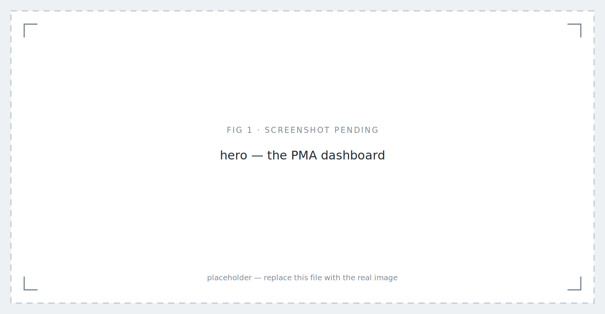
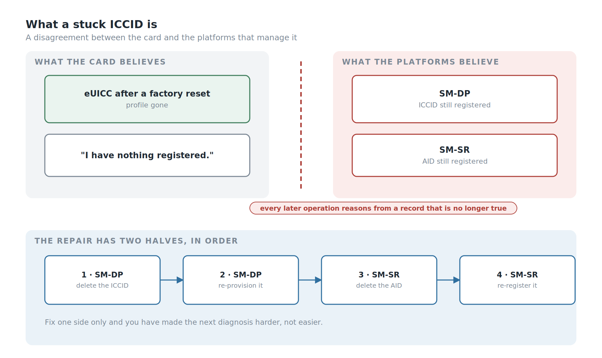
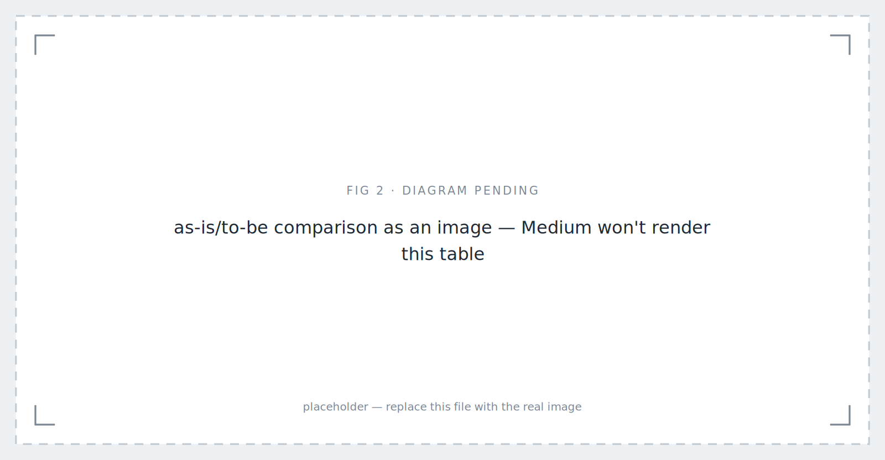
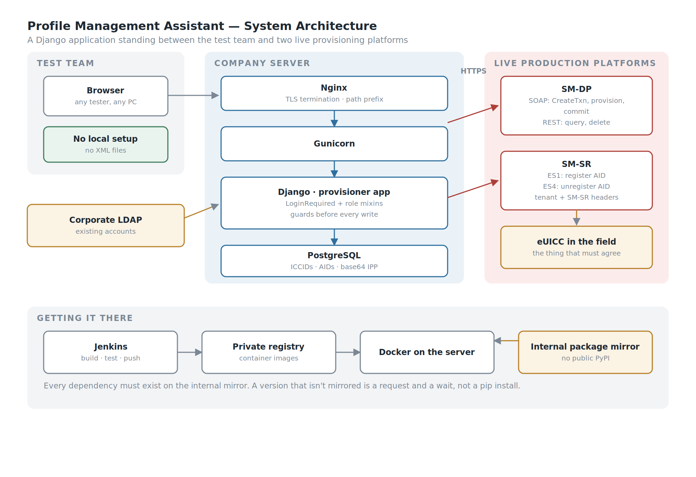
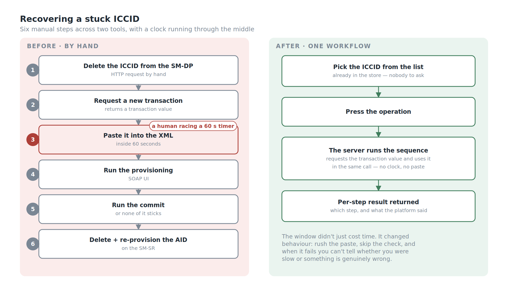
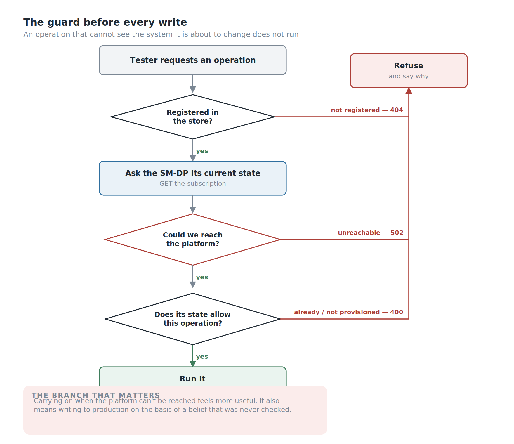
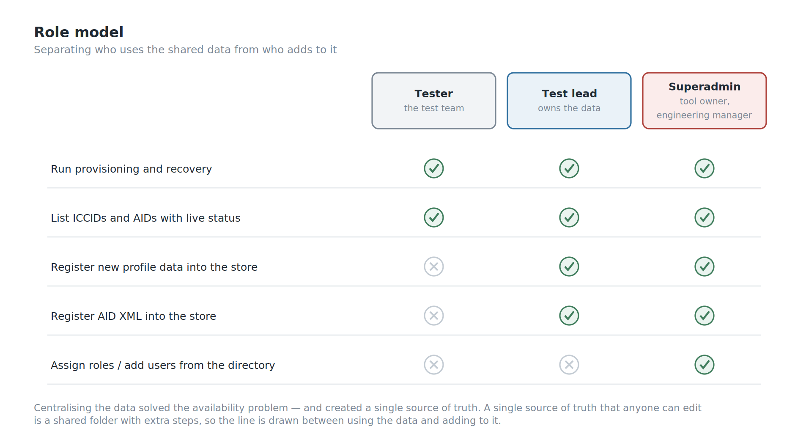
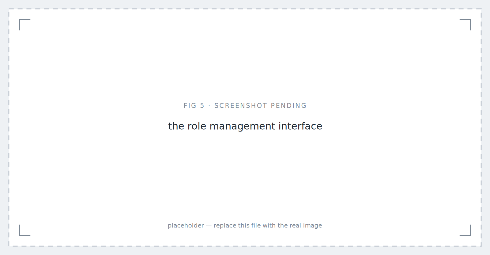

*Profile Management Assistant: Version 1 — placeholder image.*

## Background

An eUICC in the field is supposed to agree with the server that manages it. Sometimes it doesn't.

The failure we hit often enough to build a tool around is what we call a **stuck ICCID**. A card in a device gets reset to factory state — but the ICCID stays registered against the application identifier on the server side. The card has forgotten. The platform hasn't. From that moment the two disagree, and every subsequent operation is reasoning from a record that no longer describes reality.

*The card has forgotten. The platforms haven't.*

Recovering from it is not hard. It is just long, and it has to be done in a specific order, by hand, against live production systems, under time pressure.

Here is what a tester did before this tool existed:

1. **Delete the registered ICCID from the SM-DP** with an HTTP request.
2. **Request a new transaction** from the provisioning server to obtain a transaction value.
3. **Copy that value into the provisioning XML** — and do it inside one minute, because the value rotates every minute.
4. **Run the ICCID provisioning** through SOAP UI.
5. **Run the commit transaction**, which is what actually makes the provisioning stick.
6. **Delete the AID registered in the SM-SR**, and re-provision it, so the application state on the server matches what is really on the UICC.

Six steps, two different systems, two different tools, one hand-copied value, and a sixty-second timer running through the middle of it.

Do it once and it's a mildly annoying afternoon. Do it repeatedly — which is exactly what testing looks like — and it becomes the job.

But the repetition wasn't the worst part either.

## The Part Nobody Put In A Ticket

**Not every tester had the XML files.**

The provisioning XML for a given ICCID lived wherever the person who last used it had saved it. Which meant that when you hit a stuck ICCID, step zero of the recovery was: find someone who has the file for this card, and ask them for it.

If they were in a meeting, you waited. If they were on leave, you waited longer. If they had left, you hoped someone else had a copy.

And a new tester joining M2M product testing didn't inherit any of it. They started with nothing, and assembled their own collection of profile data by asking around, one file at a time, until they had enough to work independently. That is not onboarding. That is archaeology.

So the real problem was never the six steps. It was that **the data required to do the job lived in individual people's folders**, and the procedure required to use it lived in individual people's heads.

The Profile Management Assistant is a web application that holds both.

## My Role

- **Ega Guntara** — everything: architecture, backend, provisioning integration, authentication, roles, deployment pipeline, tests

Built solo, from April to July 2026.

## Case Study

Some context for readers who don't live in this world.

This is **M2M remote provisioning** — the GSMA **SGP.02** architecture, not the consumer SGP.22 flow most people have met through eSIM on a phone. The difference matters. In the consumer architecture the device drives the process and a person taps a confirmation. In M2M there is no person and often no screen: a module in a meter, a vehicle or a tracker is provisioned remotely by the platform, with no user to intervene when something goes wrong.

Two server roles matter here. The **SM-DP** prepares and delivers profiles. The **SM-SR** manages them once they're on the card — which profile is enabled, what's installed, what state each one is in.

A stuck ICCID is a disagreement between what those servers believe and what the card actually contains. Both have to be corrected, in the right order, or you've fixed half of it and made the next diagnosis harder.

| | As-is (before) | To-be (with PMA) |
|---|---|---|
| Profile XML data | scattered across individual PCs | centralised, one source |
| Getting a file you don't have | ask a colleague, wait | look it up |
| Recovery procedure | six manual steps, two tools | one workflow |
| The TNX window | copy-paste inside 60 s | handled by the server |
| New tester ramp-up | collect files by asking around | log in |
| Who can do what | anyone with SOAP UI | roles |

*As-is/to-be comparison as an image — Medium won't render this table — placeholder image.*

## Stakeholders and Requirements

Before writing code, I wrote down who the tool was for and what it had to guarantee.

**Stakeholders**

- **Testers** — run the recoveries every day; need the data and the procedure without asking anyone.
- **Test leads** — own the profile data; need to control who can add to it or change it.
- **Engineering manager** — needs the tool to be safe against production platforms and maintainable after I move on.
- **IT and company policy** — decide the login system (corporate LDAP), the package sources (internal mirror only) and where the tool may run (company servers).
- **The live SM-DP and SM-SR platforms** — not people, but the system every operation changes, so their state is a requirement in its own right.

**Functional requirements**

- **F1.** One central store for ICCIDs, AIDs and their profile data.
- **F2.** The recovery sequence runs as one automated workflow, including the timed transaction value.
- **F3.** Every workflow reports a result per step: which step ran, and what the platform answered.

**Non-functional requirements**

- **N1.** Login through the company's LDAP; no separate passwords.
- **N2.** Roles that separate using the data from adding to it.
- **N3.** An operation refuses to run when the platform's current state can't be verified.
- **N4.** Deployable on company infrastructure, from the internal package mirror.

## Workflow

The design follows directly from the two problems: the data was scattered, and the procedure was manual and timed.

So the tool is two things stacked. Underneath, **a store**: ICCIDs, AIDs and their associated profile data, in one database, available to everyone who's allowed to see it. On top, **a set of operations** that use that store to talk to the live SM-DP and SM-SR — so the six-step recovery becomes a workflow the server executes rather than a checklist a human follows.

*A store underneath, operations on top, two live platforms on the other side.*

Four objectives:

1. **Centralise the profile data** so no tester is ever blocked waiting for a colleague to send a file.
2. **Automate the timed sequence** so the transaction value is fetched and used by the same process, not copied by a human against a clock.
3. **Keep it usable by the whole test team**, including people who joined last week.
4. **Make it survivable in a corporate environment** — the company's authentication, the company's servers, the company's package sources, the company's rules.

## Building the System

The stack is **Django** with **PostgreSQL**, served by **Gunicorn** behind **Nginx**, running in **Docker**, deployed through a **Jenkins** pipeline to an internal container registry, authenticating against corporate **LDAP**.

None of that is exotic. All of it was chosen because it's what the environment could actually run.

### Why a Web Application

The same reason I built Obtana, my OTA test platform, as a web application, arriving from a different direction.

A script would have automated the six steps. It would not have solved the file problem, because a script still needs the XML, and the XML would still have lived on somebody's laptop. Worse, a script would have needed a working Python environment on every tester's machine — and I had already watched what that costs.

A web application solves both at once: the data lives where the application lives, and the only thing a tester needs is a browser and an account. New testers don't collect files. They log in and the files are there.

### Closing the Sixty-Second Window

Step 3 of the manual procedure is a human copying a value that expires in a minute.

That is not a difficult problem to solve in software — the same process that requests the transaction value uses it, and the interval between the two is measured in milliseconds rather than in how quickly someone can alt-tab. But it's worth being precise about what it actually fixes, because "we automated a copy-paste" undersells it.

A timed manual step doesn't just cost time. It **changes how people behave around it**. You don't start the sequence when you're about to be interrupted. You rush the paste and don't check it. When it fails you're not sure whether you were too slow or whether something is genuinely wrong, so you retry — against live systems — instead of investigating.

Removing the window removes all of that, and the failure mode afterwards is honest: if it fails now, something is actually wrong.

*Six steps across two tools, with a clock running through step three — replaced by one workflow.*

### Operating Against Live Systems

This part deserves to be stated plainly rather than buried: **PMA deletes and re-provisions records on live production SM-DP and SM-SR systems.**

Not a staging copy. The real ones.

That raises the cost of every category of mistake in the application. A bug in a hobby project wastes an evening. A bug here writes to a production platform managing profiles on cards that are in the field, in devices, doing a job.

It's also the clearest justification for two things that might otherwise look like over-engineering on an internal tool — the roles, and the tests.

So the operations are built to refuse.

Before provisioning an ICCID, the tool checks that the record exists in its own store, then asks the SM-DP what it currently believes about that ICCID. If the platform says the ICCID is already provisioned, the request is rejected rather than duplicated. Before deleting, the same check runs in reverse: if the ICCID isn't there, there is nothing to delete and the request is refused.

The case that matters most is the third one. **If the tool cannot reach the SM-DP to check at all, it refuses to proceed.**

That is a deliberate choice and it's worth defending, because the alternative is tempting. A tool that carries on when it can't verify feels more useful — it does what you asked instead of complaining about the network. But an operation against a production platform, issued without knowing the platform's current state, is a guess. Sometimes the guess is right. When it isn't, you have written to a live system on the basis of a belief you never checked.

The rule I settled on: **an operation that cannot see the system it is about to change does not run.**

*Three ways to refuse. The middle one is the one worth having.*

### Authentication and Roles

Login is **corporate LDAP** — the account a tester already has, no separate credential to issue or forget. That was a company requirement rather than a preference, and it's the right requirement: an internal tool with its own user table is a small identity system nobody wants to maintain.

On top of that sits a three-role hierarchy:

- **Tester** — run the provisioning operations.
- **Test lead** — that, plus register new profile data into the store.
- **Superadmin** — that, plus manage who has which role. For now that's me, as the tool's owner; the team's engineering manager joins this role next.

The separation that matters is between **using** the data and **adding** it. Anyone on the team may need to recover a stuck ICCID; not everyone should be writing new records into the store that everyone else depends on. Centralising the data solved the availability problem, but it also created a single source of truth — and a single source of truth that anyone can edit is just a shared folder with extra steps.

One implementation detail worth mentioning because it's a real edge case: roles have to be assignable to people who have **never logged in**. Django only knows about a user once they've authenticated, but a superadmin wants to grant access on Monday to someone starting on Wednesday. So role management — a section of the dashboard only superadmins see — looks up accounts in the directory and pre-creates them, rather than waiting for a first login that hasn't happened yet.

*The line is drawn between using the shared data and adding to it.*

*The role management interface — placeholder image.*

### Building Inside the Walls

This is the part that took the most time, and it isn't a feature.

**Every dependency has to come from the company's internal package mirror.** Not PyPI. If a version isn't mirrored, you don't `pip install` it — you request it, and you wait.

That constraint turns ordinary dependency management into negotiation, and it produces a specific and maddening class of failure: a package that builds fine anywhere else fails here, because the exact combination of versions available internally isn't the combination the package expects. The one that cost me the most time involved a library whose build system still imported a module that modern packaging tools had removed — resolvable, but only once you understand that the error you're reading is about the *build* environment rather than the application.

A few other things the environment taught me:

**Behind TLS termination, Django needs telling.** Nginx handles HTTPS and forwards internally over plain HTTP, so Django sees an insecure request and rejects the form with a 403. The fix is one setting. Finding it is not, because the symptom — CSRF failure — points at the form.

**Turning off debug mode turns off the tracebacks.** With `DEBUG=False` and no logging configured, a 500 error is a blank page and nothing in the console. You are debugging a production application with no information at all until you configure logging explicitly.

**Serving under a path prefix touches every request the front end makes.** The application lives under a sub-path, which the framework handles for its own URLs — and does nothing about for the URLs hardcoded in JavaScript. Every `fetch` needs the prefix injected, and the ones you forget fail only when that part of the page is used.

**Linux is case-sensitive. Windows isn't.** Code that ran on my machine failed in the pipeline over a capital letter in a filename.

None of these are interesting problems. All of them are the actual work of shipping something inside a corporate network, and articles about internal tools tend to skip them entirely — which is why people who've only built things on their own laptop are surprised by how long it takes.

### Testing an Internal Tool

Twenty-nine tests, on a tool used by one team.

That ratio looks excessive for internal software right up until you remember what the application talks to. The tests aren't there because the code is complicated. They're there because the blast radius of a wrong operation includes a production provisioning platform.

They caught something I would not have caught by hand: **a missing login check is invisible to a logged-in user.** You don't find it by clicking around, because you are logged in. You find it by writing a test that asks what happens when you aren't. Every endpoint now has one.

The suite also covers the things that are easy to believe without checking. The role split is tested from both sides — a tester receives a 403 on the registration endpoints, an administrator does not — so the permission model is verified rather than assumed. The safety guards have their own tests. And after the listing broke once because the SM-DP was unreachable, that failure got its own test class: the list now survives both an unreachable platform and an exception from it, degrading a single row to "unknown" instead of taking down the page.

That last one is the pattern I'd point at. A test written after the bug, naming the bug, so it cannot come back quietly.

## What's Built, and What Isn't

**In use today**, deployed on a company server, used daily by the test team, with LDAP login and the three-role hierarchy in place.

**Still open:**

- **No history.** The store knows the current state of every ICCID and AID, but not who ran which operation, when, or what the platform answered. When something goes wrong, the tool can't yet tell you what happened before it.
- **Platform responses are parsed with regular expressions.** That works because the responses are narrow and machine-generated, but a namespace change upstream would break it quietly rather than loudly.

## SWOT Analysis

**Strengths.** Operations refuse to run when the tool cannot verify the platform's current state, which is the right default for something that writes to production and an uncommon one for an internal tool. It fixes the invisible problem — scattered profile data and the tribal knowledge around it — rather than only the visible one. It removes a timed human step, and with it a whole class of stress-induced mistakes against live systems. It uses the identity system the company already has, so there are no extra credentials. The role split protects the shared data store from the consequences of centralising it. And it's tested to a standard that matches what it can break, not what it costs.

**Weaknesses.** It operates on live production systems, which makes every defect expensive. Built by one person, so the knowledge is concentrated. There's no record of who ran which operation. And platform responses are parsed with regular expressions, which will break quietly rather than loudly if an upstream format changes.

**Opportunities.** The store now holds the profile data for the whole team, which makes it the natural place for history — who provisioned what, when, and whether it worked. With the operations already automated, running the recovery across several ICCIDs at once is an extension rather than a redesign. And the same centralisation argument applies to the other manual SOAP UI procedures that haven't been absorbed yet.

**Threats.** A tool that talks to live provisioning platforms inherits their upgrade schedule; an interface change upstream is a change I have to follow. The internal mirror constraint means a security update to a dependency isn't something I can simply apply. And a single-author tool the whole team depends on daily is a bus-factor problem regardless of how well it's tested.

## Conclusion

Against what I set out to do:

1. **Centralised the profile data**, so no tester waits on a colleague for an XML file and no new joiner has to assemble a private collection before they can work.
2. **Automated the timed provisioning sequence**, closing a sixty-second copy-paste window that shaped how people behaved around it.
3. **Used the company's existing identity system**, with a role hierarchy separating who may use the data from who may add to it.
4. **Shipped it inside a restricted corporate environment** — internal package mirror, private registry, pipeline, TLS termination, path prefix and all.
5. **Made it refuse to act when it cannot verify**, which is the property I'd defend hardest if someone reviewed this tool.
6. **No memory yet.** It knows the current state of every record, but not who changed it, when, or what the platform said at the time.

The lesson I'm taking is the same one Obtana taught me, which is why I now trust it.

Everybody could describe the pain: six steps, two tools, a timer, over and over. That was the complaint, and automating it was the obvious fix. But the thing that actually stopped people working was that the files lived on individual laptops, and the only way to get one was to ask a person who might not be there.

Nobody raised that, because it didn't feel like a defect. It felt like how things were.

The visible problem is the one you get asked to solve. The invisible one is usually the one worth solving.

Next on the list for PMA is a history of every operation, so the tool can say what happened as well as what is.

---
