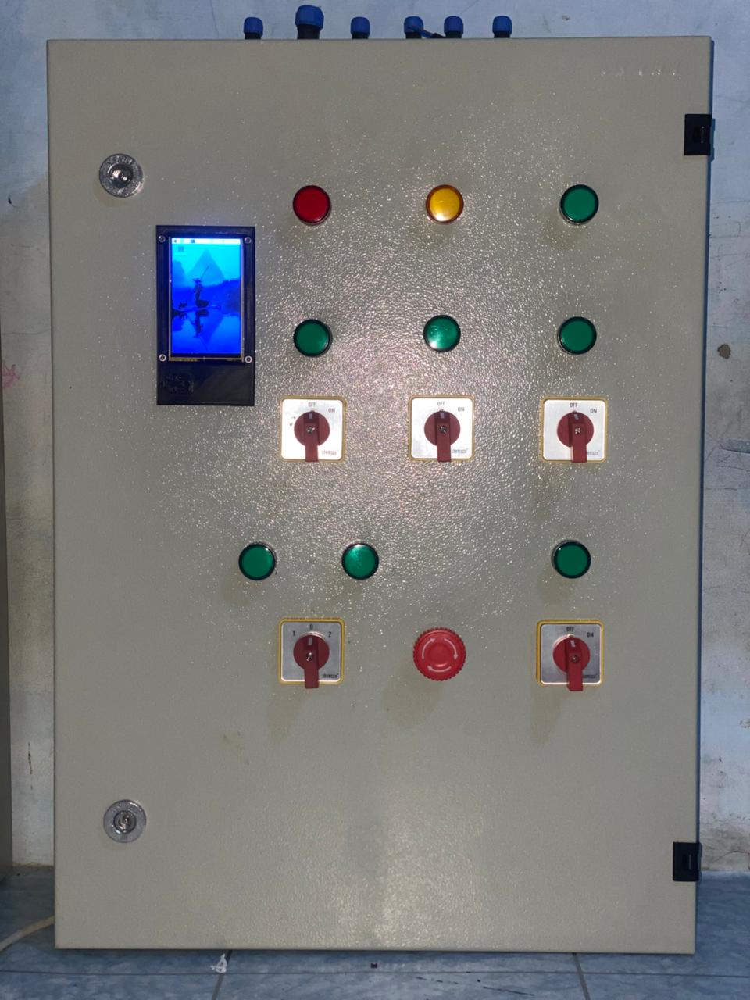
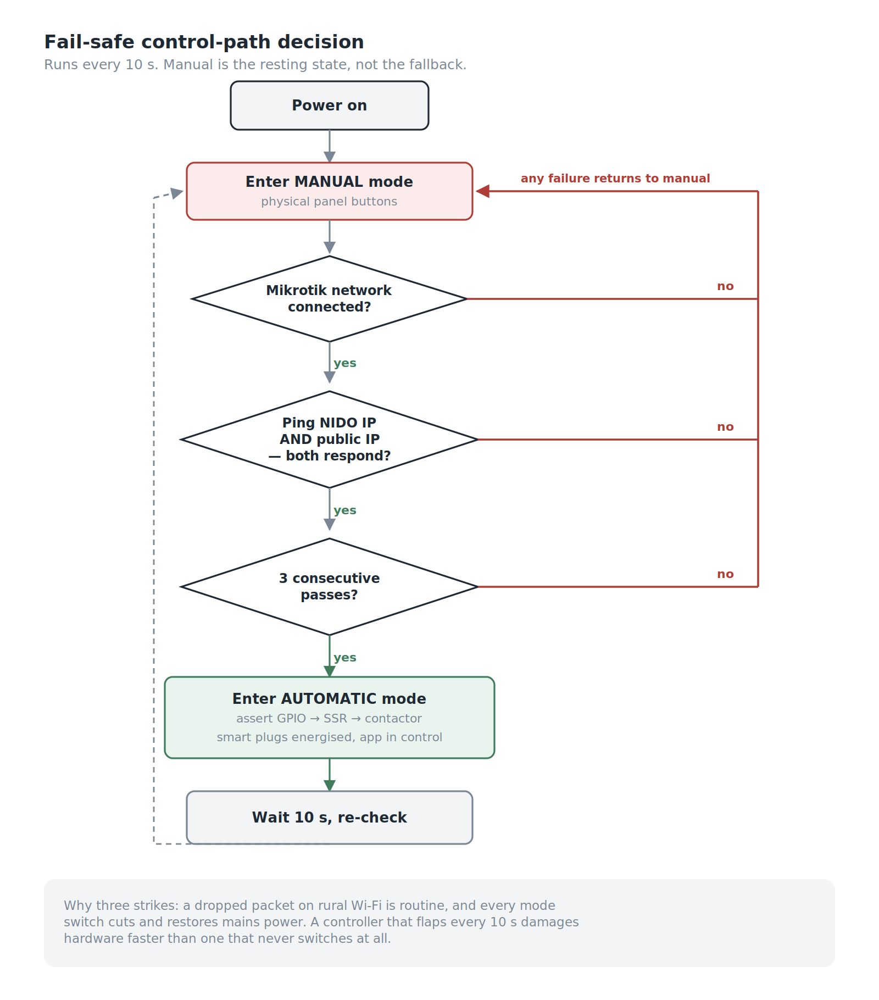
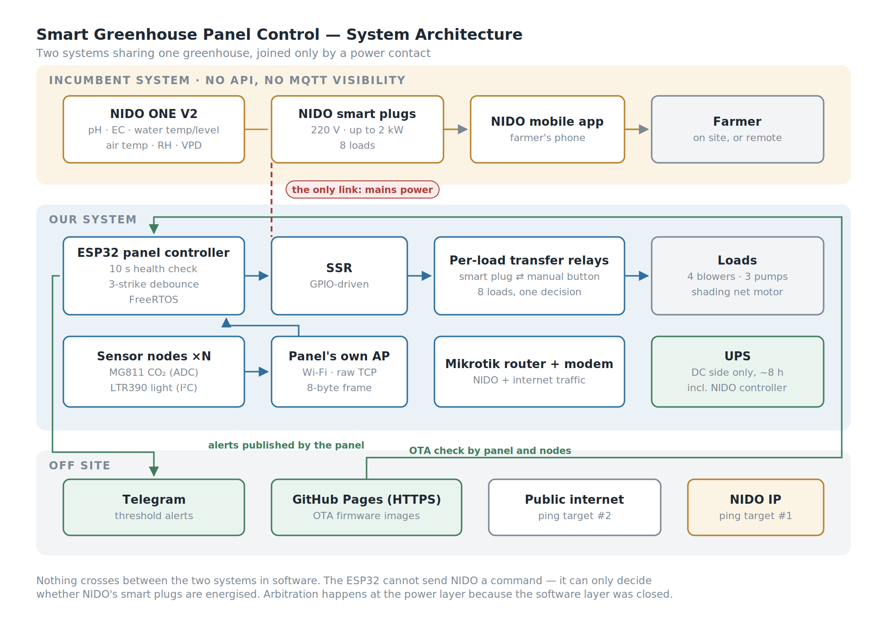
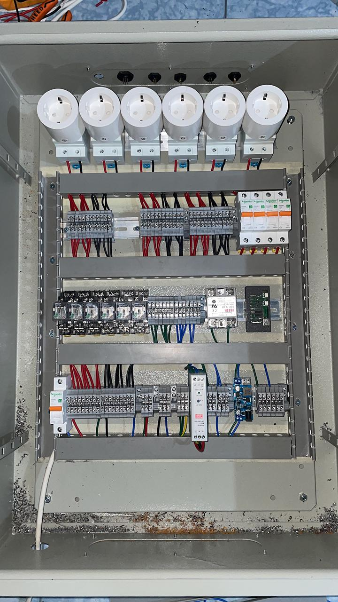
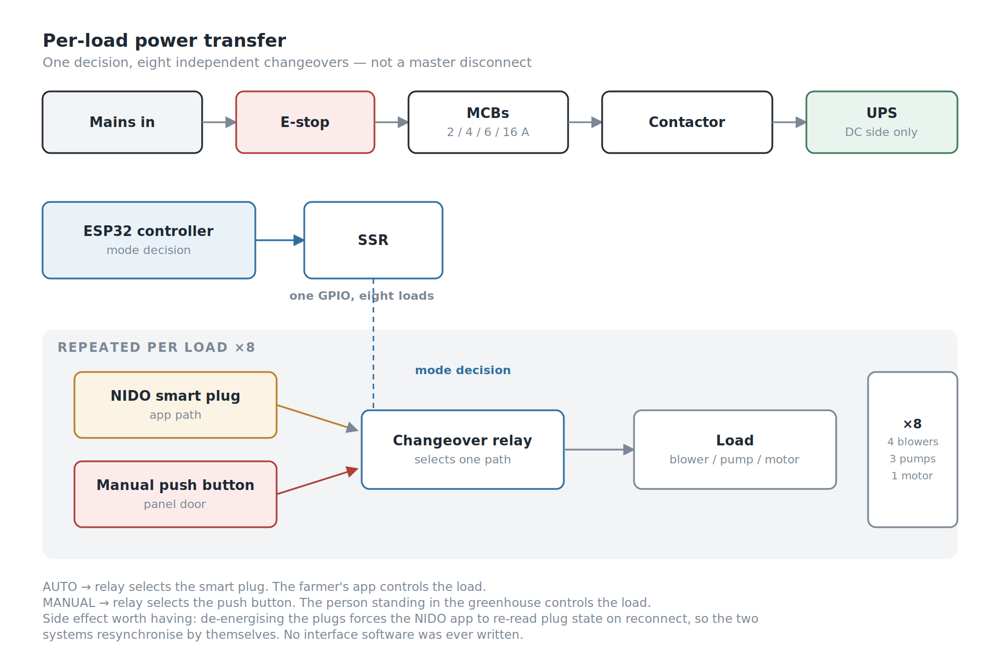
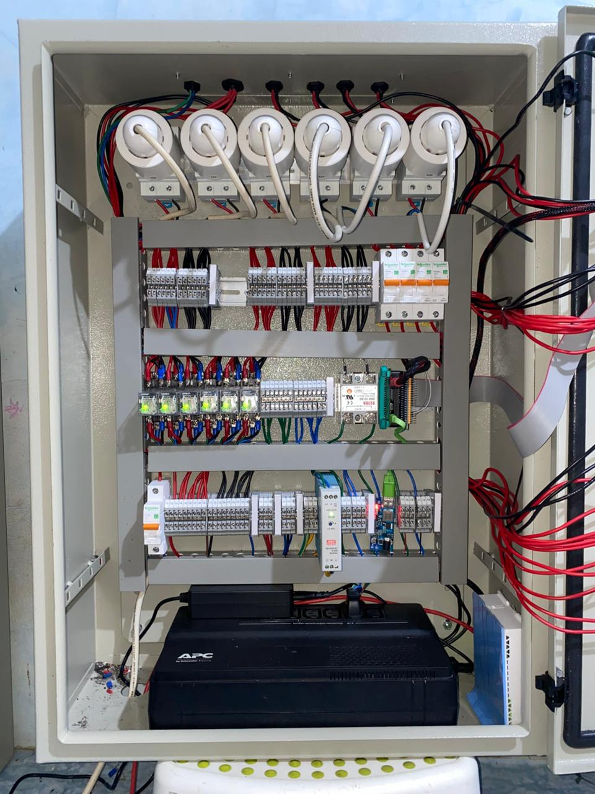
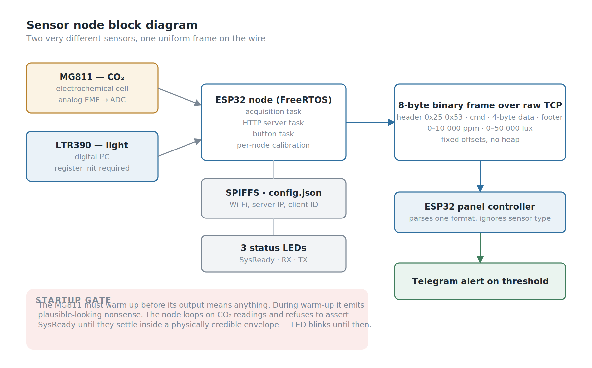
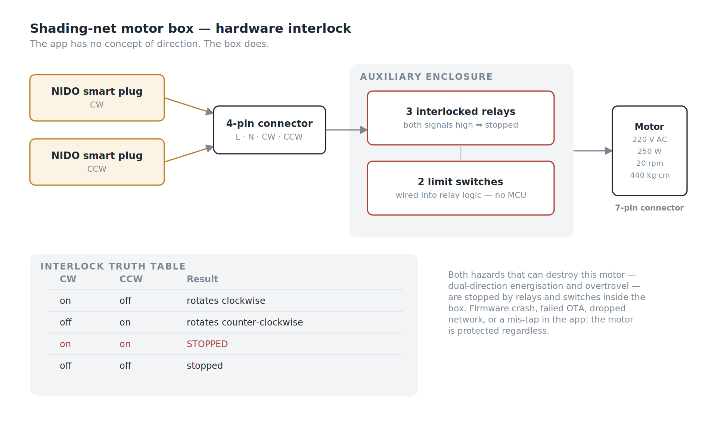
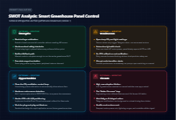

*Smart Greenhouse Panel Control: Version 1*

## Background

In the early-generation greenhouse control panels, there was a physical selector switch with two options: *manual* and *auto*. Whenever the system needed to switch modes, an operator had to physically walk over to the panel and turn the knob.

That was the odd part. On paper, the greenhouse was already equipped with a sophisticated commercial fertigation controller, digital pH and EC sensors, automated nutrient dosing schedules, and remote control via a mobile app. By any conventional benchmark, the facility was already automated. Yet in reality, the most fundamental decision — *when* the system is permitted to run automatically and when it must revert to manual — still depended entirely on an operator's physical presence, subjective on-site assessment, and the mechanical turn of a switch.

In an agricultural setting with fluctuating internet connectivity, such dependence on human intervention represents a critical vulnerability. When our team was tasked with expanding and upgrading the system's capabilities, that switch became our central focus: **On what parameters should mode-switching decisions actually be made? And could the control panel evaluate system health and make that decision autonomously?**

This article documents our engineering journey to answer those questions — from designing hardware arbitration to building dedicated sensor nodes — and the on-the-ground deployment realities that ultimately delivered lessons far beyond what our original architectural blueprints foresaw.

## My Role

- **Ega Guntara** — Project Lead, Panel Hardware, ESP32 Firmware
- **Luthfi Tantowi** — Panel Hardware
- **Dendi Hazik** — ESP32 Firmware
- **Dede Sopian** — Support & Tester
- **Hilmi** — Support

Built under **Aligness**, for a Ministry of Agriculture program, March to September 2024.

I led the project. I personally owned the panel design — component selection, wiring diagrams, UPS sizing, and the electrical control flow — and the team assembled the five panels from those drawings. The ESP32 firmware for the panel and the sensor nodes I wrote together with a teammate. Below, **"I" means work I owned personally and "we" means the team.**

## Case Study

Our client was delivering greenhouses to farmers under a government agricultural development program. A previous generation of the greenhouse was already in place, designed around a commercial product: the **NIDO ONE V2**, an all-in-one climate and fertigation controller.

It is genuinely capable equipment in its class, and understanding precisely what it does well was critical, as the boundaries of our project scope were defined by the outer limits of that device's capabilities.

For water management, it handles **pH** (0.01 resolution, ±0.05 accuracy), **EC** (0.01 mS with automatic temperature compensation), water temperature, and water level, injecting nutrients across up to 4 dosing slots into reservoirs ranging from 10 to 10,000 liters. For climate, it monitors **air temperature, humidity, and VPD**. It drives actuators through **NIDO smart plugs** — 220V mains electrical outlets rated up to 2 kW, controlled via a smartphone app.

The panel installed alongside it provided only a basic control layer: manual/auto selection via an operator switch, blower fan controls, a fertigation pump for drip irrigation, and a water reservoir refill pump.

Therefore, we posed the single most essential question: what do crops require that this existing technology stack neither measures nor responds to?

| Requirement | NIDO ONE V2 | Previous Panel | Our System |
|---|---|---|---|
| pH / EC dosing | ✅ | — | *(unchanged)* |
| Water temp / level | ✅ | — | *(unchanged)* |
| Air temp / humidity / VPD | ✅ | — | *(unchanged)* |
| Blowers, pumps | via smart plug | manual switch | ✅ app-controlled |
| **CO₂ concentration** | ❌ | ❌ | ✅ monitored + alerted |
| **Light intensity** | ❌ | ❌ | ✅ monitored + alerted |
| **Movable shading net** | ❌ | ❌ | ✅ |
| **Autonomous mode switching** | ❌ | ❌ *(operator)* | ✅ |
| **Remote firmware update (OTA)** | n/a | ❌ | ✅ panel + nodes |
| **Alerting on uncovered parameters** | ❌ | ❌ | ✅ Telegram |

Three of those rows represent standard IoT integration work. The row that deserves a closer look is autonomous mode switching.

## Workflow

There was a core constraint we discovered on day one that ultimately shaped the entire subsequent system design.

**We had no API access to the NIDO controller and zero visibility into its MQTT topics.** Whatever functionality the stock NIDO Lab REST API offered was entirely inaccessible in our project implementation.

This reality immediately ruled out the most conventional architectural approach. We could not build an architecture where our ESP32 reads CO₂, determines that the greenhouse requires ventilation, and calls the NIDO API to switch on a smart plug. We could not dispatch even a single software command to the incumbent system.

What we *could* do, however, was control whether those smart plugs received electrical power.

> If two systems cannot be integrated at the software layer, they can still be arbitrated at the hardware layer.

That single sentence encapsulates the essence of this entire project, and it is the principle I designed the panel around. In automatic mode, it is not the ESP32 controlling greenhouse operations — it is NIDO. The role of the ESP32 is to decide **which control path is physically energized**: control via the mobile app, or the physical push buttons on the panel door.

*Workflow of Smart Greenhouse Panel Control: Version 1 — manual is the resting state, not the fallback.*

In short, the panel starts in **Manual Mode** and stays there unless it can prove the automatic path works: the ESP32 must join the local MikroTik network, get a ping back from the NIDO controller, and reach the internet so the farmer's app can talk to the system. Only when all three succeed does it energise the NIDO smart plugs and hand control to the app. Any failure, at any point, leaves control with the physical buttons on the panel door.

Beyond this autonomous mode-switching mechanism, the system ecosystem also integrates climate monitoring (*temperature, humidity, light, CO₂*), actuator control (*blowers and shading net*), precision fertigation monitoring (*pH, ppm, water level, and water temperature*), remote firmware updates (*OTA update & logging*), and automated early warning alerts via Telegram notifications.

From this approach, four primary objectives emerged:

1. **Decide the control mode automatically**, based on real network health rather than an operator's subjective intuition or guesswork.
2. **Measure what was previously unmeasured** — CO₂ concentration and light intensity — and deliver early alerts.
3. **Add movable shading**, safely, through a controller that was never designed to handle shading nets.
4. **Make the system remotely maintainable**, given that our end users are farmers and greenhouse sites are located far outside the city.

*Two systems in one greenhouse, joined only by a power contact.*

## Building the System

The system consists of four core components: the **Power-Path Multiplexer**, the **Sensor Nodes**, the **Motor Controller Box**, and the **Firmware Update Pipeline (OTA Pipeline)**.

### Power-Path Multiplexer (Panel Hardware)

*Inside the control panel*

The ESP32 runs a connection health check every **10 seconds**, pinging both the NIDO controller IP and a public internet IP. Both must respond, and the check must pass **three consecutive times**, before the panel commits fully to automatic mode.

I set the three-strike rule because a single dropped packet on rural Wi-Fi links is commonplace, and a controller that toggles modes every ten seconds is far more dangerous than one that does not switch at all. Every mode switch involves cutting and reconnecting mains power, so *flapping* (rapid oscillatory switching) is not merely an aesthetic quirk — it poses a severe threat to component longevity.

If the check succeeds, the ESP32 asserts a GPIO pin driving a **solid-state relay (SSR)**, which activates the main AC contactor/relay supplying mains power to the smart outlets (NIDO smart plugs). With the smart plugs energized, the farmer's app gains full operational control over blowers, pumps, and the shading curtain motor.

If a failure occurs, the GPIO signal drops (*LOW*), power to the smart plugs cuts off instantly, and all electrical loads are immediately routed back to be supplied directly through the manual push buttons on the panel door.

The rule in one line: **automatic mode sources each load from its smart plug; manual mode sources it from its push button.**

*One decision, eight independent changeovers — not a master disconnect.*

Each load — four blowers, three pumps, and the shading net motor — features its own changeover system: a NIDO smart plug on one side, a manual button on the other, with a relay selecting between the two. This is a **per-load transfer arrangement**, not a single master disconnect switch, with each load driven by the unified mode decision. Overarching the entire assembly is an emergency stop button (*E-stop*) that completely disconnects incoming mains power; when pressed, the only devices that remain operational are those backed up by the UPS.

Two ping targets represent two distinct failure modes:

- **NIDO IP unreachable** — the controller or the local network is down. Even a flawless internet connection provides no benefit; the app cannot communicate with the controller regardless.
- **Public IP unreachable** — the local network is functioning normally, but the site has lost internet connectivity, preventing the farmer's smartphone from reaching the system.

In both scenarios, the appropriate response is identical: dissolve the illusion that the mobile app is in control, and return operational authority over the greenhouse to the human standing on site.

There was an added benefit to this design that I had not planned for. Because the smart plugs lose power in manual mode and regain it when automatic mode engages, **the NIDO app re-reads plug status upon reconnection** and synchronizes its state with actual greenhouse conditions. I never had to write state reconciliation logic between the two disparate systems — power-cycling the plugs inherently forced the incumbent software to resynchronize on its own. We got the functional benefits of full system integration without a single line of interface software.

*The assembled panel: MCBs and changeover relays on the rails, SSR and ESP32 on the middle rail, the UPS at the bottom.*

I selected every component in the panel and drew the wiring the team built from. Inside are a UPS, a 12V DC power supply with step-down converters, the ESP32 module and relay shield, SSR, per-load changeover relays with manual push buttons, MCBs rated at 2, 4, 6, and 16 A, contactors, a Mikrotik router, a cellular modem, load indicator lamps, and mode status indicators.

The UPS covers the **DC side only** — the controller, router and modem, and the NIDO controller — for roughly **8 hours**. It does not back the SSR, the changeover relays or the loads.

That was partly a constraint. I could not find a UPS small enough to fit inside the enclosure that could also carry the full load, so the choice was between backing the electronics properly or backing everything badly. But it is also the right split. During a grid outage the pumps and blowers cannot run anyway, so keeping their switching alive buys nothing. What the UPS protects is the electronics — the NIDO controller above all, which is the most expensive and least replaceable part of the installation — and it keeps the network and controller up long enough to *report* the outage.

One consequence is worth stating plainly: because the relay coils are not on the UPS, manual mode does not survive a power cut either. When the grid goes, the greenhouse stops, whichever mode it was in.

### Sensor Nodes (CO₂ and Light Intensity)

*Two very different sensors, one uniform frame on the wire.*

CO₂ and light intensity are two critical parameters for plant growth that went unmeasured in the legacy system. A teammate and I built dedicated ESP32 nodes to monitor both, powered via direct cable runs from the main panel.

The two sensors exhibit completely contrasting operational characteristics. CO₂ sensing relies on the **MG811**, an electrochemical cell that yields a tiny analog electromotive force (EMF) voltage read through an ADC. Meanwhile, light sensing utilizes the **LTR390**, an I²C-based digital ambient-light and UV sensor whose output is pre-conditioned, yet requires register-level initialization sequences before it can stream any data.

The node abstracts away these architectural differences completely. Both sensors are calibrated directly at the node level and stream standardized data: floating-point values in standard engineering units — **0–10,000 ppm** for CO₂, and **0–50,000 lux** for light intensity — wrapped inside identical frame structures. The main panel parses a single uniform data format without needing to know whether the upstream sensor is an analog electrochemical cell or a digital I²C module. Performing calibration at the node level (rather than centrally at the panel) also ensures that each node encapsulates its own calibration offsets, making units seamlessly hot-swappable in the field during maintenance.

Data travels from node to panel over **the panel's own Wi-Fi access point** — a separate network from the Mikrotik router, which carries NIDO and internet traffic — as a standardized **8-byte binary frame** over raw TCP:

| Field | Size | Value |
|---|---|---|
| Header | 2 bytes | `0x25 0x53` |
| Command index | 1 byte | `0x01` (light), `0x02` (CO₂) |
| Data | 4 bytes | MSB first |
| Footer | 1 byte | — |

Eight bytes per reading, parsed at fixed memory offsets without dynamic heap allocation. I chose not to run an MQTT broker — for a static set of nodes deployed across an isolated local network, MQTT would simply introduce extra daemon overhead requiring installation, monitoring, and process supervision on a local server that technicians would likely never touch again following project handover.

**The most compelling aspect of the node firmware lies not in its data streaming path, but in its initial startup sequence.**

The MG811 sensor operates electrochemically. Its output EMF is only valid once its internal heating element stabilizes at operating temperature, a process requiring several minutes. Throughout this warm-up phase, the sensor generates erratic output that resembles plausible data but represents zero physical reality. Firmware that read these figures immediately would broadcast corrupted values and trigger false Telegram emergency alerts regarding non-existent hazardous CO₂ spikes.

So I wrote the node not to declare itself ready the moment it boots. The startup routine loops continuously on CO₂ readings and only asserts `SysReady` once readings stabilize within a physically credible envelope. At that point, the initialization task terminates and the primary monitoring daemon takes over. Throughout the warm-up cycle, the system status LED blinks rather than holding solid — visually signaling that incoming sensor data is not yet trustworthy.

> An energized sensor is no guarantee of an operational sensor, and the latency between those two states must be explicitly accommodated within the system architecture.

The node runs on **FreeRTOS** with distinct execution threads for sensor acquisition, HTTP server tasks, and button monitoring, complemented by three indicator LEDs for *system-ready*, RX, and TX status. All configuration parameters — Wi-Fi credentials, server IP, and client IDs — reside in a `config.json` file inside a **SPIFFS** flash filesystem partition rather than being hardcoded into source code, allowing field configuration adjustments without firmware recompilation.

One candid architectural limitation must be acknowledged: CO₂ and light intensity are **strictly monitored, not automatically acted upon**. The panel ingests readings and triggers Telegram alerts whenever values drift beyond predefined thresholds, but no actuators adjust autonomously. This is because all greenhouse ventilation actuators are governed by the NIDO system, and NIDO features no logical inputs for CO₂ parameters. We closed the *sensing* gap, but not the *control* gap.

### Motor Controller Box (Shading Net)

*The app has no concept of direction. The box does.*

The shading net is driven by a 220V AC electric motor — 250 W, 20 rpm, 440 kg·cm torque — controlled via **two NIDO smart plugs**, designated for clockwise (CW) and counter-clockwise (CCW) rotation respectively. In this manner, farmers can open and close the curtain directly from the smartphone app as easily as turning on any household appliance.

This naturally raised a crucial engineering question: the mobile app has no intrinsic concept of directional interlocks. What prevents an accidental screen tap from energizing both rotational directions simultaneously?

I planned the motor box with one teammate — motor selection, relay logic, wiring, and connectors — and the answer we settled on was that directional protection never gets delegated to the application layer at all. The motor control box lives in its own auxiliary enclosure with its own discrete relay logic. It receives main feed and control signals from the main panel through a 4-pin circular connector (neutral, line, and two directional control wires), and interfaces to the motor via a 7-pin industrial connector. Three interlocked relays enforce directional integrity:

| CW Signal | CCW Signal | Motion Result |
|---|---|---|
| on | off | rotates clockwise (CW) |
| off | on | rotates counter-clockwise (CCW) |
| on | on | **stopped / does not rotate** |
| off | off | stopped / does not rotate |

If both directional signals are asserted concurrently, the physical logic resolves strictly to *motor stationary*, so the motor can never be driven in both directions at once, which would damage its windings. Two mechanical limit switches are wired directly into the relay logic inside the enclosure to arrest travel at both track extremities — these limit switches bypass the ESP32 microcontroller entirely and do not depend on firmware execution to operate reliably.

**The two primary hazards capable of destroying the motor — simultaneous dual-direction energization and running past track travel limits — are completely mitigated by hardware relay logic inside the box, isolated from software or app-level dependencies.** If upstream layers crash, OTA updates fail, network connections drop, or an operator accidentally taps conflicting UI buttons, the motor remains unconditionally shielded from mechanical damage. External CW and CCW indicator lamps allow technicians to verify travel state at a glance without unbolting the enclosure.

### Remote Firmware Update Pipeline (OTA Pipeline)

Our end users are rural farmers operating in remote agricultural regions. A firmware bug without a reliable remote update pipeline would necessitate costly on-site service trips for every patch — often the decisive dividing line between a sustainable long-term installation and an abandoned project. So I built remote update into both the main panel and the sensor nodes; the node firmware main routine executes an update check prior to servicing downstream loops.

Firmware binary images are hosted securely over **HTTPS via GitHub Pages**. The targeted firmware version is embedded within the running binary; upon checking, the device compares its local version with the release version published on the server, downloading the new binary whenever a newer build is discovered. This represents one of the simplest, most robust OTA architectures possible: requiring no dedicated build servers, private artifact repositories, or complex server infrastructure that could incur maintenance liabilities years after handover.

## What Went Wrong (*Field Deployment Realities*)

There were very few technical failures, and that statement is ironically the least interesting part of this article.

The sensor nodes were installed close to the control panel, meaning Wi-Fi propagation across the 18 × 18 meter greenhouse structure never posed an issue. Mode transitions in the field were stable: no relay chatter, no false switching triggers, and no electrical loads firing uncommanded. The three-strike debounce mechanism proved completely effective. The shading net motor never once overshot its mechanical limits or attempted conflicting dual-direction rotation.

The system operated exactly as it was engineered to do. Yet its ultimate real-world impact diverged dramatically from our expectations.

Version 1 panels were installed across **five greenhouse sites**, each measuring 18 × 18 meters. According to the latest operational monitoring data, **only a single unit continues to operate in automatic mode.**

The remaining four greenhouses remain in full commercial crop production. The control panels remain securely mounted. Blower fans, irrigation pumps, and shading nets continue to run every day. What ceased operating was the smart automation layer: farmers found the simultaneous combination of a brand-new greenhouse environment, mobile smartphone apps, and unfamiliar IoT control paradigms overwhelming, and ultimately elected to operate everything manually. They did not tamper with or dismantle the hardware. They simply stopped opening the mobile app, allowing the installation to rest permanently in manual mode.

There is an easy, comforting narrative where the engineering is deemed flawless and end users are faulted for failing to adapt. That narrative is fundamentally mistaken. We knew from day one that the end users were farmers, yet we still delivered an architecture whose primary operational interface depended on a mobile app within an ecosystem we did not design, deployed in regions where internet infrastructure is chronically unstable. Nobody on our team was assigned to shepherd user onboarding, and nobody conducted usability testing to verify whether the software was intuitive for people living and working on site daily. That was a scoping failure, and as project lead it was mine. Scoping is exactly the part of engineering that deserves the hardest scrutiny.

Yet there is a silver lining, and it is the reason I still believe the architecture was the right one.

**The manual fallback path is the sole component of this system that remains in continuous, daily use across every single site.** The physical push buttons, load indicator lamps, mode indicators, emergency stop switches (E-stop), and mechanical limit switches on the motor enclosure — everything capable of functioning without internet, without mobile apps, and without microcode — serve as the primary operational backbone keeping four out of the five greenhouses running today.

Had we approached manual mode the way many engineering teams do — as a perfunctory, bare-bones emergency override rather than a fully realized control architecture — those four greenhouses would now be stranded behind a dead, inaccessible automation barrier. Because physical manual control was engineered as a first-class citizen equipped with clear visual telemetry and hardwired safety interlocks, the system degraded gracefully into an intuitive, productive tool that farmers could actually run, rather than collapsing into scrap iron.

We designed manual mode to endure temporary internet blackouts lasting a few hours. In practice, it successfully weathered a technology adoption blackout that has lasted for years.

## SWOT Analysis

**Strengths.** Arbitrating two disparate systems at the electrical power layer allowed us to expand the functionality of a closed commercial product without requiring any API access, while smart plug power-cycling yielded automated state resynchronization for free. Safety-critical interlocks are hardwired directly into electro-mechanical relays, residing entirely beneath layers susceptible to software crashes. The physical manual control path was engineered so comprehensively that it can sustain total greenhouse operations independently — an attribute that ultimately proved more vital than any other feature we built.

**Weaknesses.** CO₂ and light monitoring remain strictly open-loop: parameters are measured and reported via alerts, but trigger no automatic actuator corrective actions. The health-check routine verifies network reachability rather than incoming grid power; during utility blackouts or when the E-stop is triggered, the UPS-backed panel continues reporting automatic mode even though downstream field actuators are completely inert — making the system most confident precisely when it possesses the least operational authority. OTA updating lacks cryptographic certificate pinning and automated rollback routines. Connected electrical loads energize immediately upon mode transition, meaning an engaged manual toggle button will power on a pump the split-second power transfers to that circuit. The packet structure lacks checksum validation, forcing communication recovery to rely solely on header re-alignment during mid-stream disconnections.

**Opportunities.** Socket-level power arbitration is already proven, making the addition of closed-loop CO₂ mitigation for our dedicated loads a natural progression. Grid voltage detection (mains-sense monitoring) requires only a single optocoupled feed line and an unused GPIO pin. Implementing an A/B dual flash partition scheme with embedded root CA certificates would make OTA updates safe to roll back in future deployments.

**Threats.** The primary risk facing the system is social, not technical. Four out of five installations reverted to manual operation, and no amount of clever software enhancements will resolve an adoption hurdle. Developing a Version 2 (V2) that does not center on the day-to-day user experience of farmers will merely replicate the same outcome with more polished firmware.

## Conclusion

A conclusion must evaluate against original project objectives. From this project, we conclude that:

1. **Made the manual/automatic mode-switching decision autonomous**, governed by debounced network health monitoring rather than operator guesswork, while cleanly arbitrating two independent control systems directly at the electrical layer.
2. **Measured and alerted on CO₂ levels and light intensity**, two crop-critical environmental parameters overlooked by the incumbent controller — albeit as human notifications rather than closed-loop automated actions.
3. **Integrated a motorized movable shading net** into a control system never architected for it, with both destructive failure modes completely neutralized by hardware relay interlocks rather than software.
4. **Rendered the fleet remotely maintainable**, establishing an OTA pipeline that should be hardened with enhanced security safeguards before subsequent deployments.

And one paramount lesson we never anticipated: the layer we designed merely as a fallback turned out to be the layer that outlasted all others. Building the degraded path properly turned out to be the highest-leverage decision I made on this project, even though I made it for a completely different reason at the time.

The next version of the greenhouse panel will start with the farmer's day, not with the firmware.

---
