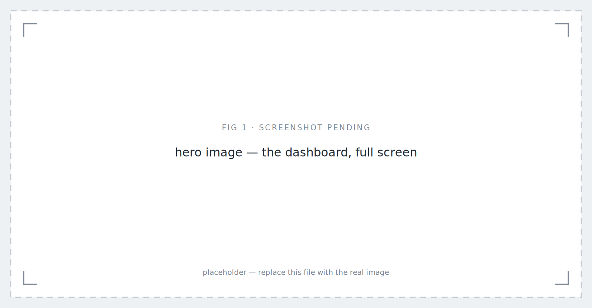
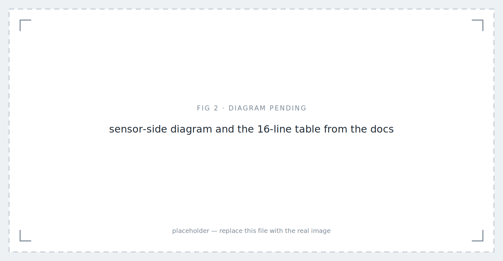
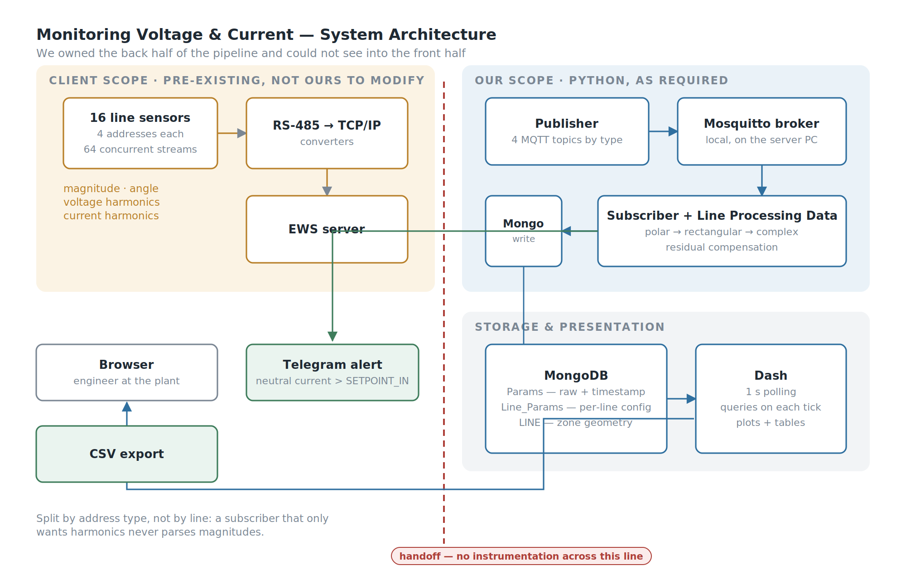
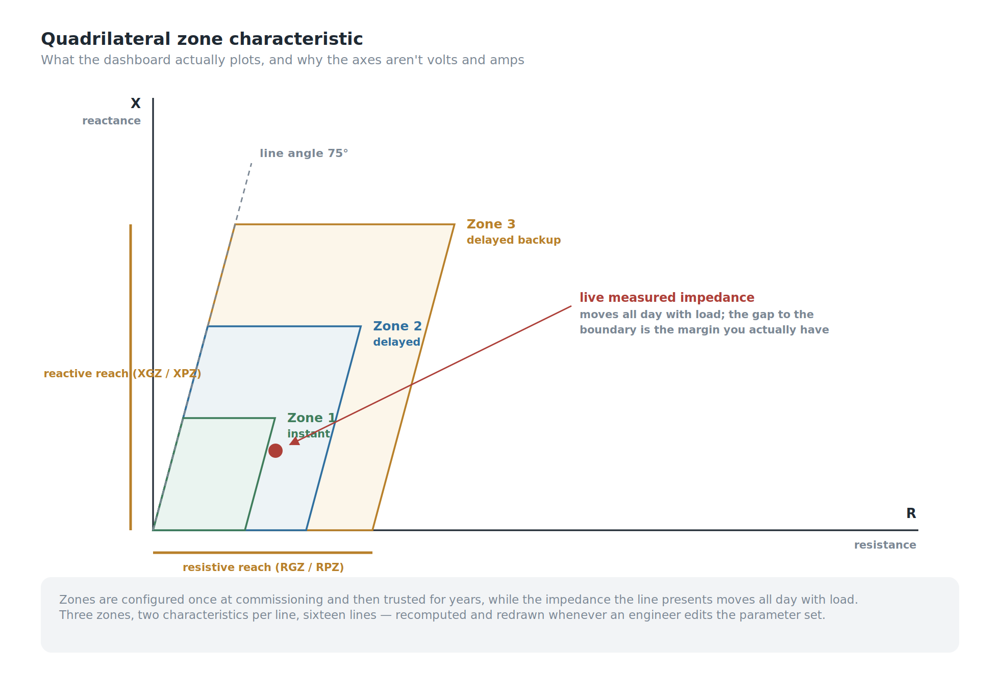
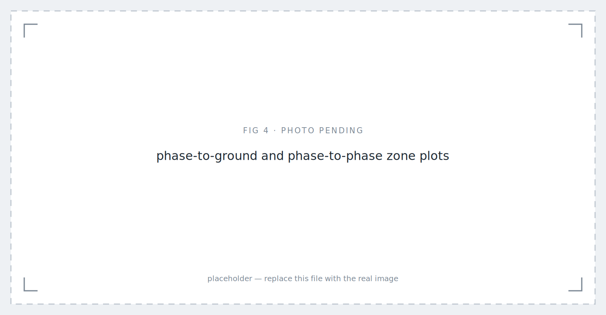
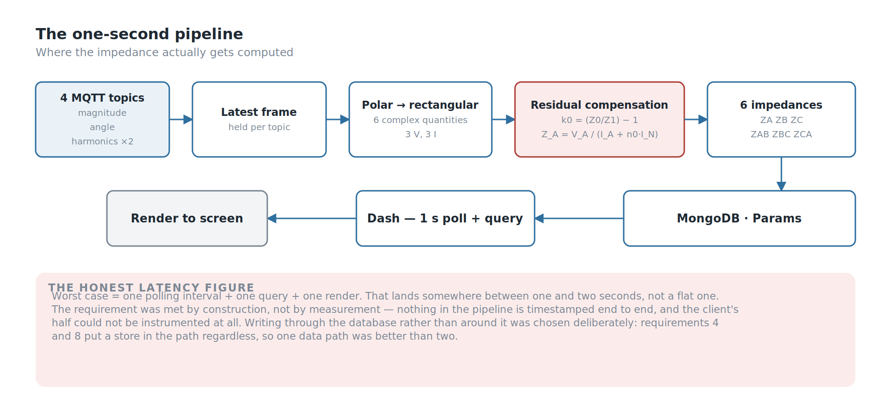
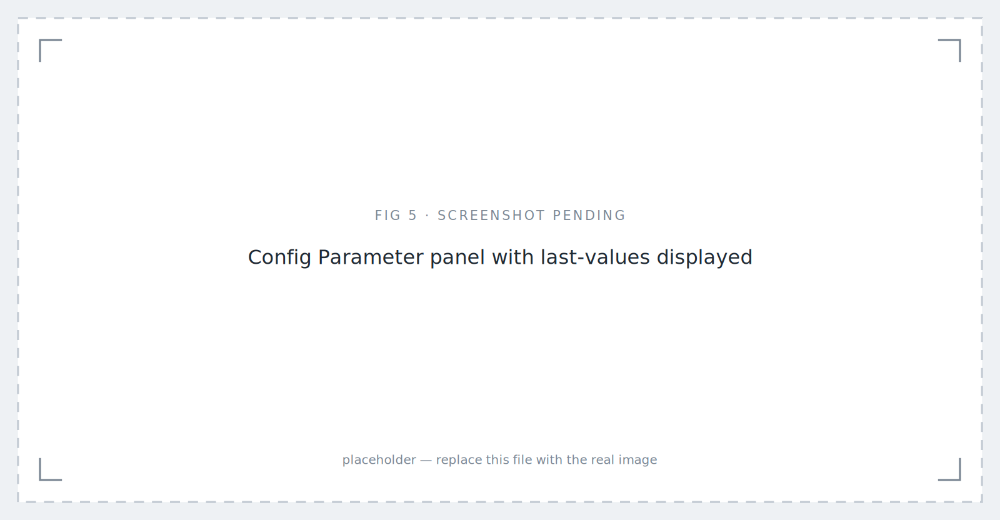
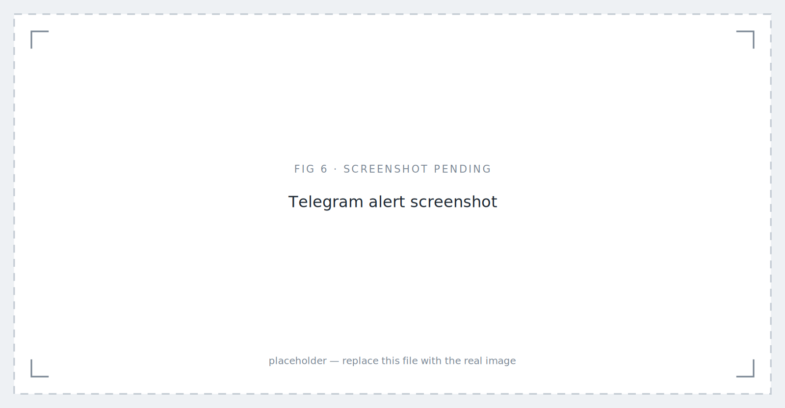
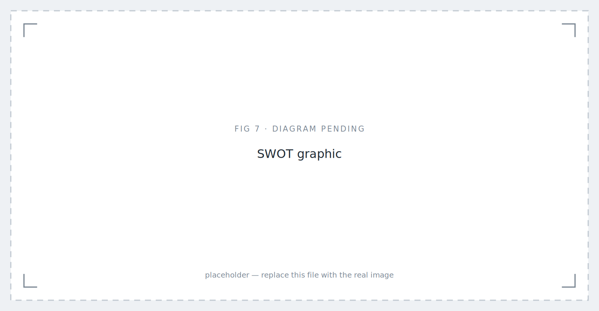

*Monitoring Voltage & Current System: Version 1 — placeholder image.*

## Background

Most monitoring projects begin with someone who can't see something. This one began with a number.

**One second.** From the sensor on the line to a plotted point on the screen, in under one second. In Python, because Python was what the client's environment ran and what their engineers could maintain after we left.

That would be a reasonable ask if we owned the whole pipeline. We didn't. The client owned the measurement chain — the power sensors on each line, the RS-485 to TCP/IP converters, the routing into their EWS server. All of it already built, none of it ours to modify, and none of it instrumented in a way we could see into.

So the real brief was: hit a one-second end-to-end budget on a pipeline where you control the back half and can't measure the front half. Almost every decision in this article traces back to that.

## My Role

- **Ega Guntara** — Project Lead, IoT Engineer, System Architect
- **Dede Sopian** — Support & Testing

Built under **Aligness**. The client is a power plant and remains confidential throughout.

## Case Study

A power line is protected by a **distance relay**. It decides whether a fault has occurred by measuring the impedance it sees looking down the line, and its settings define three zones: Zone 1 covering most of the protected line and tripping instantly, Zones 2 and 3 reaching further with deliberate time delays so that they act as backup.

Those zones get configured once at commissioning, and then trusted for years.

Meanwhile the impedance the line actually presents moves around all day with load. Nobody watches where it sits relative to those boundaries. The settings are a static document; the line is a live thing.

So the system we were asked to build isn't really a monitoring dashboard. It's this:

> Live measured impedance for each line, plotted against the configured protection zones.

Not *here are your volts and amps*, but *here is how much margin you actually have, right now, against settings someone chose two years ago.*

The scale is easy to undersell. There were **16 line sensors**, each exposing **four addresses**:

- **Line magnitude** — frequency, three phase voltages plus average, three line-to-line voltages plus average, three phase currents plus average, neutral current. Fourteen values.
- **Line angle** — phase angles for three voltages and three currents.
- **Voltage harmonics** — 3rd and 5th per phase.
- **Current harmonics** — 3rd and 5th per phase.

Sixty-four concurrent streams, all of which had to be current on screen, alongside two live impedance plots.


*Sensor-side diagram and the 16-line table from the docs — placeholder image.*

## Workflow

The scope split was explicit from the start. **The client's scope** ran from the sensor to the EWS server. **Our scope** was everything after that:

1. Publish the retrieved data to an MQTT broker
2. Set up the broker on the server PC
3. Subscribe and retrieve
4. Store to a database
5. Apply the client's formulas — the step we called **Line Processing Data**
6. Build the web dashboard: values, plots, and the parameters feeding the formulas
7. Allow those parameters to be changed live, from the dashboard
8. Export calculated line data to CSV


*Workflow of Monitoring Voltage & Current System: Version 1*

## Building The System

Four things worth elaborating: the **Line Processing Data** maths, the **Zone Characteristic**, the **one-second pipeline**, and the **live parameter editing** that turns a demo into a tool.

### Line Processing Data — Why You Can't Just Divide V by I

This is the part of the project that justifies the project.

For a **phase-to-phase** fault the obvious formula works. Take the difference of two phase voltages over the difference of the two phase currents:

```
Z_AB = (V_A − V_B) / (I_A − I_B)
```

For a **phase-to-ground** fault it doesn't, and this is the trap. The return path goes through earth, and earth has a different impedance than the phase conductor. Dividing phase voltage by phase current gives you a number that looks entirely plausible and is systematically wrong — which is the worst kind of wrong, because nothing about the output tells you it's incorrect.

The correction is **residual compensation**. From the ratio of zero-sequence to positive-sequence impedance, which the client supplies per line as a magnitude and an angle:

```
k0 = (Z0 / Z1) − 1
n0 = k0 / 3
Z_A = V_A / (I_A + n0 · I_N)
```

where `I_N` is the residual current.

Everything upstream exists to feed this. Magnitudes and angles arrive on separate topics, get converted from polar to rectangular, get assembled into complex numbers, and only then can the compensated division happen. Six complex quantities per line — three voltages, three currents — produce six impedances: **ZA, ZB, ZC** for the ground loops and **ZAB, ZBC, ZCA** for the phase loops.

It's roughly forty lines of Python. Anyone can plot a voltage. Knowing that a ground fault returns through earth, and that this changes the denominator, is the part that took domain reading rather than coding.

One note for completeness: in this build `I_N` is carried as a value the client supplies rather than derived inside our calculation, so the summation path exists in the source but isn't the one in use. It's worth naming because it sits in the denominator of every ground-loop result.

### The Zone Characteristic


*What a quadrilateral zone is, before the real plots.*


*Phase-to-Gnd and Phase-to-Phase zone characteristics — placeholder image.*

Each line's protection zones are stored as a **quadrilateral characteristic** — the shape a modern distance relay actually uses, rather than the circular mho characteristic of older designs.

A zone is defined by its **resistive reach** (RGZ for ground, RPZ for phase) and **reactive reach** (XGZ, XPZ), plus the line angle, which at this plant was **75°**. From those, the system derives the corners: the reach point along the line angle, the top-right corner at reach plus resistive reach, and the lower boundary rotated by the line angle. Three zones, two characteristics per line, sixteen lines.

Those geometries are computed and stored, then redrawn whenever the parameters change — which is what makes the parameter editor matter rather than being a convenience.

One cosmetic defect worth owning: the plot axes are labelled Voltage and Current, inherited from an early prototype that plotted raw measurements. They show resistance and reactance. The data is right; the labels are a leftover.

### The One-Second Pipeline


*Where the impedance actually gets computed — and why the honest latency is one to two seconds.*

The architecture is deliberately boring, and that was the point.

**Four MQTT topics**, one per address type — magnitude, angle, voltage harmonics, current harmonics. Splitting by type rather than by line means a subscriber that only cares about harmonics never parses magnitudes, and each payload stays small. In production the broker runs locally on the server PC.

The subscriber holds the latest frame per topic, runs Line Processing Data as messages arrive, and writes to **MongoDB**. Three collections: **Params** for raw timestamped measurements, **Line_Params** for the per-line configuration, **LINE** for computed zone geometry.

The dashboard is **Dash**, polling on a one-second interval and querying MongoDB on each tick.

That last decision is the one I'd expect to be challenged, so here's the reasoning. The alternative — holding current values in memory for the callbacks to read directly — is faster and skips a database round trip. It's also invisible: nothing persists, nothing can be filtered later, nothing can be exported, and a restart loses everything. Requirements 4 and 8 put a database in the path regardless. Writing *through* it rather than *around* it meant one data path instead of two.

The cost is honest: worst-case latency is one polling interval plus a query plus a render, so the real figure sits between one and two seconds rather than a flat one. We met the requirement by construction rather than by measurement, and those are not the same claim.

**Why Dash and not Grafana?** Grafana would have given us live dashboards, time-series storage and CSV export for free, and for a pure monitoring brief it would have been the right answer. It couldn't do the two things this project needed. The impedance calculation isn't a query — it's complex arithmetic with per-line compensation constants that has to run before anything can be plotted. And the zone characteristics aren't data, they're geometry derived from a parameter set the user edits at runtime. Given a hard "must be Python" requirement, a tool that pushed the interesting half somewhere else would have defeated the point.

**Why MongoDB and not InfluxDB?** For the Params collection alone, a time-series database would have been better — compression, retention, downsampling, all free. But the store isn't only time-series. Line_Params holds a nested per-line configuration and LINE holds zone geometry as nested coordinate objects, two dozen named corner points per characteristic. That's document-shaped data, written as a unit and read as a unit. Splitting across two databases for a system a small team had to maintain wasn't worth the ceremony. Extending rather than delivering, I'd move Params to a time-series store and leave the configuration where it is.

### Live Parameter Editing


*Config Parameter panel with last-values displayed — placeholder image.*

Requirement 7 sounds like a nice-to-have and is actually the difference between a demo and a tool.

The zone characteristic depends entirely on a parameter set an engineer might want to revise: resistive and reactive reaches for three zones in both modes, the line angle, and the sequence impedance ratio. Requiring a code change and a restart for each revision would have made the system unusable for the people it was built for.

So the dashboard exposes the full parameter set per line, with three details that matter more than they look:

- **The last applied value is shown above each input**, so an engineer editing a live system sees what they're about to change before they change it.
- **Apply is disabled until every field is populated**, because a partially applied parameter set produces a plausible-looking wrong characteristic — which is worse than an obviously broken one.
- **Non-numeric input is rejected with a warning** rather than silently coerced.

On apply, values are written back to MongoDB and the zone geometry is regenerated immediately, so the plot updates against the new configuration.

The set also carries `delta_t`, `id2`, `line_length` and the CT and VT ratios. These are stored and editable but not consumed by our calculations — the client applies them on their side. Storing values you don't use feels wrong until you remember whose system it is.

### Filtering, Export, and Alerting

Raw measurements land in Params with a timestamp. The dashboard filters between a start and end timestamp in a fixed `YYYY-MM-DD_HH:MM:SS` format, renders the result as a table, and exports it to CSV — the mechanism by which anything leaves the system and enters someone's analysis.

There's also a threshold alarm: neutral current above a configurable **SETPOINT_IN** fires a **Telegram** notification. Neutral current on a three-phase feeder is a proxy for unbalance, and unbalance is the sort of thing you want on your phone rather than in next week's report. Telegram over email or SMS was pragmatic — free, instant, already on the operators' phones, about fifteen lines to implement.


*Telegram alert screenshot — placeholder image.*

## Testing

**Twelve functional cases and nine negative cases.** The negative set is the more interesting half: malformed timestamp format, end timestamp earlier than start, CSV export attempted before any data is filtered, incomplete parameter sets, non-numeric parameter input, non-numeric setpoints.

That ratio reflects where the risk actually sat. The happy path was never going to be the problem. A user pasting a timestamp in the wrong format, or applying half a parameter set to a live protection display, was.

## SWOT Analysis


*SWOT graphic — placeholder image.*

**Strengths.** The system does the thing that's genuinely hard in this domain — correct ground-loop impedance with residual compensation — and presents it against the actual protection settings rather than in isolation. Live parameter editing with last-value display and validation makes it usable by the engineers it was built for. The one-second target was met with an architecture simple enough for the client's own team to maintain in the language they asked for.

**Weaknesses.** Latency was met by construction, not measured end to end. The axis labels are wrong. Concurrency between the MQTT subscriber and the dashboard relies on the GIL and a slow refresh rate rather than a queue. Connection strings were embedded in source rather than configuration. And half the stored parameter set is inert on our side, which is defensible but should be visible in the UI rather than implied.

**Opportunities.** Splitting the store — time-series data in a time-series database, configuration in Mongo — would pay for itself as Params grows. Instrumenting the pipeline with end-to-end timestamps would turn "we met the spec" into a number. And the same zone-margin view could drive trending: not just where the impedance is now, but how its margin has moved over a month.

**Threats.** The system's usefulness depends entirely on the parameter set matching the relay's real settings. Nothing in the design verifies that, so a stale parameter set produces a confident, well-drawn, wrong picture. Any future version should reconcile against the relay itself.

## Conclusion

A conclusion should answer the objectives. From this project we conclude that:

1. We were able to **take the data across the handoff and get it to screen inside the required window**, using MQTT into MongoDB into a polling Dash front end, entirely in Python.
2. We were able to **implement the client's Line Processing Data correctly**, including residual compensation for ground loops, producing six impedances per line rather than a naive V-over-I approximation.
3. We were able to **render the protection zones as quadrilateral characteristics** and plot live impedance against them, for both phase-to-ground and phase-to-phase.
4. We were able to **make the parameter set editable at runtime** with validation and last-value display, and to filter, export and alert on the stored data.

The thing I'd carry into the next one: when you own half a pipeline, the honest engineering question isn't whether you hit the number, it's whether you can prove it. We could have, and we didn't.

The dashboard met its one-second budget by design. The next step is to measure it.

---

*`[Author bio.]`*
